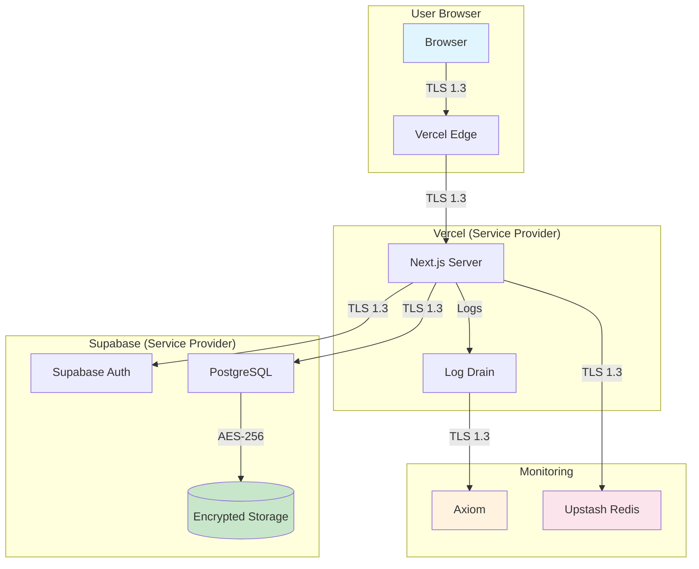

# Third-Party Vendors

This document lists all third-party services that process data for Curator, as required by CCPA/CPRA transparency requirements.

---

## Vendor Summary

| Vendor | Role | Data Type | DPA Status |
|--------|------|-----------|------------|
| Vercel | Service Provider | Logs, Assets | ✅ Signed |
| Supabase | Service Provider | All User Data | ✅ Signed |
| Axiom | Service Provider | Logs Only | ✅ Signed |
| Upstash | Service Provider | Cache Data | ✅ Signed |

---

## 1. Vercel

**Purpose:** Application hosting and edge delivery

**Data Processed:**
- HTTP request logs (IP, User-Agent, Path)
- Static assets
- Serverless function execution

**Role:** Service Provider (processes data on our behalf only)

**Security Measures:**
- SOC 2 Type II certified
- TLS 1.3 encryption in transit
- Edge network DDoS protection

**DPA:** [Vercel Data Processing Agreement](https://vercel.com/legal/dpa)

**Data Retention:** 30 days (logs)

---

## 2. Supabase

**Purpose:** Database, authentication, and storage

**Data Processed:**
- User accounts (email, profile)
- Application data (items, categories, ratings)
- Authentication tokens
- File uploads

**Role:** Service Provider

**Security Measures:**
- SOC 2 Type II certified
- AES-256 encryption at rest
- Row-Level Security (RLS)
- Point-in-time recovery

**DPA:** [Supabase Data Processing Agreement](https://supabase.com/legal/dpa)

**Data Location:** United States (aws-us-east-1)

---

## 3. Axiom

**Purpose:** Log aggregation and monitoring

**Data Processed:**
- Application logs
- Error traces
- Performance metrics
- IP addresses (for security)

**Role:** Service Provider

**Security Measures:**
- SOC 2 Type II certified
- Encrypted storage
- Role-based access control

**DPA:** [Axiom Data Processing Agreement](https://axiom.co/legal/dpa)

**Data Retention:** 30 days (configurable)

---

## 4. Upstash

**Purpose:** Redis cache and rate limiting

**Data Processed:**
- Rate limit counters
- Session cache data
- Temporary application state

**Role:** Service Provider

**Security Measures:**
- SOC 2 Type II certified
- TLS encryption in transit
- Encrypted at rest

**DPA:** [Upstash Data Processing Agreement](https://upstash.com/trust/dpa)

**Data Retention:** TTL-based (max 24 hours)

---

## Data Flow Diagram

### Encryption Status

| Segment | Encryption |
|---------|------------|
| Browser ↔ Vercel | TLS 1.3 (In-Transit) |
| Vercel ↔ Supabase | TLS 1.3 (In-Transit) |
| Supabase Storage | AES-256 (At-Rest) |
| Upstash Cache | TLS + Encrypted (Both) |

---

## Subprocessor Changes

We will provide 30 days notice before adding new subprocessors. Subscribe to updates at: privacy@curator.app

---

Last updated: January 2026
