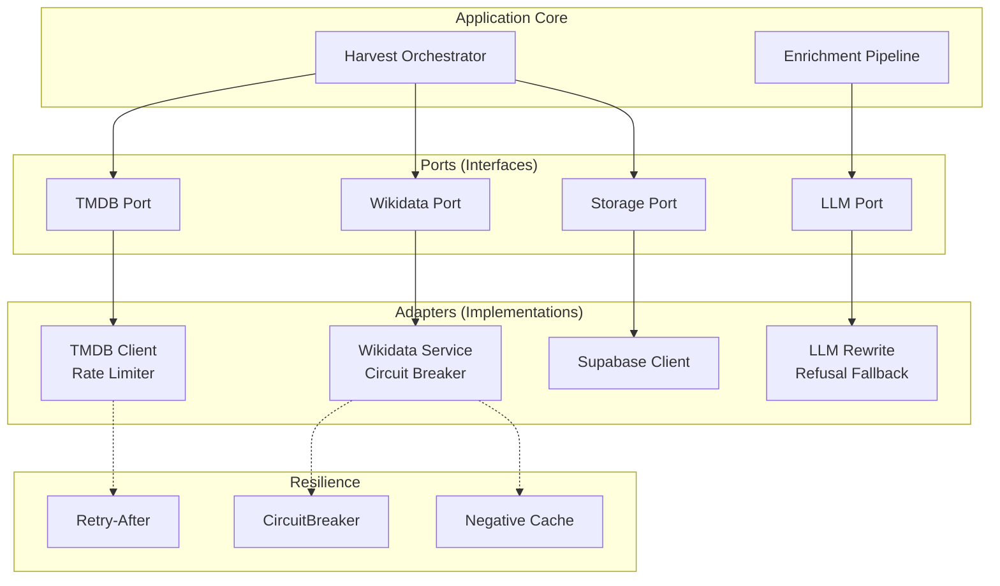

# TV Show Harvest & Backfill Walkthrough

> **Version**: 5.0 (CRON Recovery + Production Ready)  
> **Last Updated**: 2026-02-05

This document describes the complete TV show pipeline from initial harvest through embedding generation, including classification, enrichment, TVDB integration, franchise detection, Wikidata federation, controlled vocabulary, and all rehydration workflows.

---

## Table of Contents

1. [File Inventory](#file-inventory)
2. [Phase 1: Harvest](#phase-1-harvest)
3. [Phase 2: Classification](#phase-2-classification)
4. [Phase 3: Format Taxonomy](#phase-3-format-taxonomy)
5. [Phase 4: Character Archetypes](#phase-4-character-archetypes)
6. [Phase 5: Franchise Classification](#phase-5-franchise-classification)
7. [Phase 6: Universe & Spinoff Detection](#phase-6-universe--spinoff-detection)
8. [Phase 7: Wikidata Federation](#phase-7-wikidata-federation) *(NEW)*
9. [Phase 8: Description Generation](#phase-8-description-generation)
10. [Phase 9: Tag Generation](#phase-9-tag-generation)
11. [Phase 10: Controlled Vocabulary](#phase-10-controlled-vocabulary) *(NEW)*
12. [Phase 11: IAB Taxonomy](#phase-11-iab-taxonomy) *(NEW)*
13. [Phase 12: Embedding Generation](#phase-12-embedding-generation)
14. [Phase 13: Backfill](#phase-13-backfill)
15. [Phase 14: Vector Search](#phase-14-vector-search)
16. [Database Schema](#database-schema)
17. [Extensibility Guide](#extensibility-guide)
18. [Data Flow Summary](#data-flow-summary)

---

## File Inventory

### Core Files (Ordered by Data Flow)

| File | Lines | Purpose |
|------|-------|---------|
| `src/scripts/harvest-tmdb.ts` | ~117 | CLI entry point |
| `src/lib/harvesters/tmdb.ts` | ~1180 | Main harvester (TMDB + OMDb + TVDB) |
| `src/lib/harvesters/shared.ts` | ~570 | Shared utilities (embedding, tags) |
| `src/lib/ai/tv-show-description.ts` | ~1488 | Semantic classification & description |
| `src/lib/ai/franchise-classification.ts` | ~353 | Save the Cat franchise types |
| `src/lib/enrichment/categories/tv-show.ts` | ~130 | Barrel re-exports |
| `src/lib/services/search.ts` | ~443 | Vector search |

### Franchise Discovery Files *(NEW)*

| File | Lines | Purpose |
|------|-------|---------|
| `src/lib/constants/franchise-keywords.ts` | ~129 | TMDB keyword → universe mapping |
| `src/lib/services/franchise/media-graph.ts` | ~215 | Creator graph BFS algorithm |
| `src/lib/services/franchise/index.ts` | ~20 | Barrel exports |

### Semantic Architecture Files *(NEW in v3.0)*

| File | Lines | Purpose |
|------|-------|---------|
| `src/lib/services/wikidata.ts` | ~280 | Wikidata SPARQL + fail-open + negative cache |
| `src/lib/services/tvdb.ts` | ~400 | TVDB v4 API (JWT, enrichment, anime, rate limiting) |
| `src/lib/constants/controlled-vocabulary.ts` | ~295 | 50+ moods, 30+ themes, TVDB normalization |
| `src/lib/constants/iab-taxonomy.ts` | ~130 | IAB 3.0 unscripted facets |

### Backfill Files

| File | Lines | Purpose |
|------|-------|---------|
| `src/scripts/backfill/index.ts` | ~150 | Backfill orchestrator |
| `src/scripts/backfill/config.ts` | ~48 | Configuration |
| `src/scripts/backfill/phases/smart.ts` | ~211 | Smart conditional fill |
| `src/scripts/backfill/phases/rehydrate.ts` | ~187 | TMDB refresh (no LLM) |

**Total**: ~5,500+ lines across 18 core files

---

## Phase 1: Harvest

### Entry Points

```bash
# Harvest new TV shows from TMDB by year
npx tsx src/scripts/harvest-tmdb.ts --type=tv --operation=harvest

# Backfill existing items with missing fields
npx tsx src/scripts/harvest-tmdb.ts --type=tv --operation=backfill --limit=500
```

### Data Flow

```
harvest-tmdb.ts
  → tmdb.ts:harvestTmdb()
    → triageExistingItems()      # Check what exists
    → processHarvestTask()       # Fetch, classify, enrich, insert
```

### What Gets Fetched from TMDB

| Category | Data Fields |
|----------|-------------|
| **Basic Info** | title, overview, first_air_date, status, vote_average, vote_count, popularity |
| **Credits** | cast (with characters), created_by, crew (writers, directors, producers) |
| **Classification** | genres, keywords (ALL - vital for classification), type ("Scripted", "Miniseries", "Documentary") |
| **Media** | poster_path, backdrop_path, logo_path, trailer (YouTube) |
| **Networks** | networks, production_companies |
| **Structure** | number_of_seasons, number_of_episodes, episode_run_time |
| **External IDs** | imdb_id, tvdb_id, wikidata_id |
| **Streaming** | watch/providers (JustWatch data) |
| **Recommendations** | recommendations (for future graph analysis) |

### Key Function: `fetchTmdbDetails()`

```typescript
// tmdb.ts:148-167
const append = 'credits,videos,images,external_ids,keywords,watch/providers,recommendations,content_ratings';
const url = `https://api.themoviedb.org/3/tv/${tmdbId}?api_key=${API_KEY}&append_to_response=${append}`;
```

### OMDb Enrichment

After TMDB, we fetch additional ratings from OMDb:

| Field | Source |
|-------|--------|
| `imdb_rating` | OMDb (more accurate than TMDB's) |
| `imdb_votes` | OMDb |
| `rotten_tomatoes_rating` | OMDb (via Rotten Tomatoes API) |
| `metacritic_rating` | OMDb |
| `awards_text` | OMDb ("Won 2 Emmys. 15 wins & 20 nominations.") |
| `content_rating` | OMDb (MPAA/TV rating, fallback from TMDB) |

### TVDB v4 Enrichment *(NEW in v3.1)*

After TMDB and OMDb, we fetch enrichment data from TheTVDB:

| Field | Source | Purpose |
|-------|--------|---------|
| `semantic_tags` | TVDB genres/tags | Curated tags merged with LLM tags |
| `characters` | TVDB characters | Cast with tier (Main/Recurring/Guest) |
| `official_lists` | TVDB lists | Franchise/universe detection |
| `content_rating` | TVDB ratings | Geographic-specific ratings |
| `absolute_episode_count` | TVDB episodes | Anime absolute ordering |

**Key Feature: Tag Merging**

```typescript
// tmdb.ts:792-807
// LLM tags generated first, then TVDB tags merged
const aiTagNames = await generateTvShowTags(llmConfig, meta.title, description);

// TVDB tags are curated - they "ground" the AI output
if (tvdbEnrichment && tvdbEnrichment.semanticTags.length > 0) {
    const existingNormalized = new Set(aiTagNames.map(t => t.toLowerCase()));
    const tvdbUnique = tvdbEnrichment.semanticTags
        .filter(t => !existingNormalized.has(t.toLowerCase()))
        .slice(0, 10);
    finalTagNames = [...aiTagNames, ...tvdbUnique];
}
```

**Anime Handling**

For shows detected as anime (TVDB genres), we fetch the absolute episode count to support contiguous viewing order:

```typescript
// Check for anime absolute ordering
if (isAnime(tvdbSeries)) {
    const absoluteCount = await getAbsoluteEpisodeCount(tvdbId, apiKey, pin);
    tvdbEnrichment.absoluteEpisodeCount = absoluteCount;
}
```

**Console Output:**
```
║ 📺 TVDB: 12 tags, 8 characters, 3 lists
║ 🎌 Anime detected: 24 absolute episodes
║ 🎯 Merged 6 TVDB tags with LLM tags
```

---

## Phase 2: Classification

### 3-Bucket System

**Function**: `detectTvBucket()` in `tv-show-description.ts:180-260`

**Purpose**: Route shows to correct AI prompt template

| Bucket | Description | Examples |
|--------|-------------|----------|
| **NARRATIVE** | Scripted fiction with story arcs | Breaking Bad, The Sopranos, Friends |
| **FORMAT** | Competition/game mechanics | Survivor, Top Chef, The Voice |
| **OBSERVATIONAL** | Documentary/non-fiction | Planet Earth, Making a Murderer |

### Detection Priority (Critical for Accuracy)

```
0a. TMDB TYPE FIELD (Strongest Signal) - FIRST CHECK
    metadata.type: "Scripted" | "Miniseries" | "Documentary"
    → "Scripted" = NARRATIVE (source of truth)
    → "Miniseries" + Documentary genre = OBSERVATIONAL
    → "Miniseries" without Documentary = NARRATIVE

0b. SCRIPTED FORCE (Negative Constraint) - SECOND CHECK
    Keywords: mockumentary, sitcom, comedy-drama, dramedy, scripted,
              workplace comedy, single-camera, multi-camera
    → If ANY present = NARRATIVE (prevents The Office → Documentary)

1. FORMAT DETECTION
    Keywords: competition, elimination, contestant, game show, host
    Genres: Game Show, Talk
    → FORMAT bucket

2. OBSERVATIONAL DETECTION
    Genres: Documentary, News
    Keywords (non-competition): following, access, behind-the-scenes
    → OBSERVATIONAL bucket

3. DEFAULT → NARRATIVE
```

### Genre Lens System

**Function**: `detectGenreLens()` in `tv-show-description.ts:280-320`

| Lens | Detection Keywords/Genres | Examples |
|------|---------------------------|----------|
| **CRIME** | crime, thriller, mystery, detective, mafia | Breaking Bad, The Wire |
| **SCIFI** | sci-fi, dystopia, space, alien | Stranger Things, Westworld |
| **FANTASY** | fantasy, supernatural, magic, vampire | Game of Thrones, The Witcher |
| **COMEDY** | comedy, sitcom, funny | Brooklyn Nine-Nine, The Office |
| **DRAMA** | drama (dominant) | This Is Us, Succession |
| **HORROR** | horror, zombie, slasher | The Walking Dead |
| **GENERAL** | Fallback | Mixed genre shows |

---

## Phase 3: Format Taxonomy

### 6-Label Format System *(Semantic Density Enhancement)*

**Function**: `detectTvFormat()` in `tv-show-description.ts:285-340`

**Purpose**: Granular format classification for vector differentiation

| Format Label | Description | Examples |
|--------------|-------------|----------|
| `SCRIPTED_SINGLE_CAM` | Cinematic, no laugh track | The Bear, Succession, Breaking Bad |
| `SCRIPTED_MULTI_CAM` | Stage-like, laugh track | Friends, Big Bang Theory, Cheers |
| `SCRIPTED_MOCKUMENTARY` | Fictional doc style | The Office, Parks & Rec, Abbott Elementary |
| `UNSCRIPTED_COMPETITION` | Game mechanics, elimination | Survivor, Top Chef, The Voice |
| `UNSCRIPTED_DOCUSOAP` | Constructed reality | Real Housewives, Keeping Up with Kardashians |
| `UNSCRIPTED_DOCUSERIES` | Educational, archival | Planet Earth, The Last Dance |
| `UNKNOWN` | Fallback | - |

### Detection Keywords

```typescript
// Format detection keywords (extensible)
SINGLE_CAM_KEYWORDS: ['single-camera', 'cinematic', 'prestige', 'cable drama', 'streaming original']
MULTI_CAM_KEYWORDS: ['multi-camera', 'laugh track', 'studio audience', 'live audience']
MOCKUMENTARY_KEYWORDS: ['mockumentary', 'docu-style', 'confessional', 'talking head']
COMPETITION_KEYWORDS: ['competition', 'elimination', 'contestant', 'challenge', 'immunity']
DOCUSOAP_KEYWORDS: ['reality show', 'interpersonal', 'lifestyle', 'real-life drama']
DOCUSERIES_KEYWORDS: ['documentary', 'archival footage', 'narrator', 'interviews']
```

---

## Phase 4: Character Archetypes

### LLM-Powered Archetype Translation

**Function**: `translateToArchetypes()` in `tv-show-description.ts:360-420`

**Purpose**: Replace character names with universal archetypes for cross-show similarity matching

| Archetype Category | Examples |
|--------------------|----------|
| **Protagonist** | Anti-Hero, Byronic Hero, Chosen One, Everyman, Cynical Genius |
| **Supporting** | Mentor, Caregiver, Trickster, Rebel, Sage, Straight Man, The Fool |
| **Dynamic** | Chaos Agent, Found Family, Incompetent Leader |

### Example Output

```
"Features Anti-Hero protagonist who descends into crime,
balanced by Caregiver wife who serves as moral compass,
with Sidekick partner who provides comic relief."
```

---

## Phase 5: Franchise Classification

### Save the Cat Methodology

**Function**: `classifyFranchiseType()` in `franchise-classification.ts`

**Purpose**: Identify the narrative engine that makes a show franchisable

| Franchise Type | Description | Examples |
|----------------|-------------|----------|
| `MONSTER_IN_THE_HOUSE` | External threat in confined space | Stranger Things, Walking Dead |
| `GOLDEN_FLEECE` | Quest/journey for a goal | Mandalorian, Breaking Bad |
| `OUT_OF_THE_BOTTLE` | Supernatural element changes ordinary world | Lucifer, Good Place |
| `DUDE_WITH_A_PROBLEM` | Ordinary person, extraordinary situation | 24, Prison Break |
| `RITES_OF_PASSAGE` | Coming-of-age transformation | Euphoria, Stranger Things |
| `BUDDY_LOVE` | Relationship-driven | Sherlock, Brooklyn Nine-Nine |
| `WHYDUNIT` | Mystery/investigation focus | True Detective, Money Heist |
| `FOOL_TRIUMPHANT` | Underdog/underestimated protagonist | Schitt's Creek, Ted Lasso |

### Storage

```sql
-- Stored in global_items.franchise_type
ALTER TABLE global_items ADD COLUMN franchise_type TEXT;
```

---

## Phase 6: Universe & Spinoff Detection

### Overview *(NEW in v2.0)*

**Purpose**: Automatically identify shared universes (Arrowverse, Chicago-verse) and spinoff relationships (Better Call Saul → Breaking Bad)

### Universe Detection via TMDB Keywords

**Function**: `detectAndResolveUniverse()` in `tmdb.ts:343-365`

```typescript
// src/lib/constants/franchise-keywords.ts
export const UNIVERSE_KEYWORD_MAP: Record<number, string> = {
    229266: 'arrowverse',       // DC CW shows
    228091: 'chicago-verse',    // Dick Wolf Chicago franchise
    180547: 'star-trek',        // Star Trek canon
    1402: 'walking-dead',       // Walking Dead universe
    268686: 'yellowstone-verse', // Taylor Sheridan shows
    951: 'law-order-universe',  // Law & Order franchise
    4330: 'ncis-verse',         // NCIS franchise
    14909: 'game-of-thrones',   // ASOIAF adaptations
    234689: 'breaking-bad',     // Breaking Bad universe
    212271: 'greys-verse',      // Grey's Anatomy universe
};
```

### Spinoff Detection via Known Relationships

**Constant**: `KNOWN_SPINOFFS` in `franchise-keywords.ts:65-106`

```typescript
// Format: [spinoff_tmdb_id, parent_tmdb_id]
export const KNOWN_SPINOFFS: [number, number][] = [
    // Breaking Bad Universe
    [60059, 1396],      // Better Call Saul ← Breaking Bad

    // Walking Dead Universe
    [62286, 1402],      // Fear the Walking Dead ← TWD
    [206584, 1402],     // Dead City ← TWD

    // Arrowverse
    [60735, 1412],      // The Flash ← Arrow
    [62688, 1412],      // Supergirl ← Arrow (crossovers)

    // Chicago Franchise
    [67993, 58841],     // Chicago Med ← Chicago Fire
    [62439, 58841],     // Chicago PD ← Chicago Fire

    // ... 30+ more pairs
];
```

### Console Output During Harvest

```
║ 🌌 Universe detected: arrowverse
║ 👨‍👦 Parent series detected
```

### Storage

```sql
-- Universe membership
ALTER TABLE global_items ADD COLUMN universe_id UUID REFERENCES tv_universes(id);

-- Spinoff lineage
ALTER TABLE global_items ADD COLUMN parent_series_id UUID REFERENCES global_items(id);
```

### Graph-Based Discovery (Future)

**Class**: `MediaGraph` in `services/franchise/media-graph.ts`

Uses BFS with weighted edges to discover implicit franchise connections via shared creators:

```typescript
const graph = new MediaGraph();

// Add connections from TMDB aggregate credits
graph.addConnection(1396, 123456, 'Creator');  // Breaking Bad + Vince Gilligan
graph.addConnection(60059, 123456, 'Creator'); // Better Call Saul + Vince Gilligan

// Find related shows (threshold 0.5 = 50% creative weight)
const cluster = graph.findConnectedCluster(1396, 0.5);
// Returns: [{ showId: 60059, distance: 1.0 }]
```

**Edge Weights by Role**:

| Role | Weight |
|------|--------|
| Creator/Showrunner | 1.0 |
| Executive Producer | 0.5 |
| Writer | 0.3 |
| Director | 0.2 |
| Producer | 0.2 |
| Production Company | 0.1 |

### MediaGraph Safety Features *(NEW in v4.0)*

**Genre Penalty**: Prevents false positives from prolific people working across disparate genres.

```typescript
// Genre compatibility groups
export const GENRE_GROUPS = {
    drama: ['drama', 'crime', 'thriller', 'mystery'],
    comedy: ['comedy', 'family', 'animation'],
    genre: ['sci-fi & fantasy', 'action & adventure', 'superhero'],
    reality: ['reality', 'documentary', 'talk'],
    horror: ['horror', 'thriller', 'mystery'],
};

// calculateGenrePenalty() returns:
// 1.0 = compatible genres (no penalty)
// 0.35 = disparate genres (significant penalty)
```

**Usage**:
```typescript
const graph = new MediaGraph();
graph.setShowGenres(1396, ['crime', 'drama']);  // Breaking Bad
graph.setShowGenres(4556, ['comedy', 'family']); // Modern Family
// BFS will apply 0.35 penalty if traversing between these shows
```

---

## Phase 7: Wikidata Federation

### Overview *(NEW in v3.0)*

**Purpose**: When TMDB keywords don't identify a universe, query Wikidata for franchise relationships.

**Service**: `src/lib/services/wikidata.ts`

### Key Wikidata Properties

| Property | Code | Description | Example |
|----------|------|-------------|---------|
| Part of the series | P179 | Parent franchise | GoT → ASOIAF |
| Narrative universe | P140 | Shared universe | Flash → Arrowverse |
| Spinoff of | P8345 | Parent show | BCS → Breaking Bad |
| Based on | P144 | Source material | The Witcher → Books |

### SPARQL Query Example

```sparql
SELECT ?partOfSeries ?narrativeUniverse ?spinoffOf WHERE {
    wd:Q161617 wdt:P179 ?partOfSeries.    # Breaking Bad
    OPTIONAL { wd:Q161617 wdt:P140 ?narrativeUniverse. }
    OPTIONAL { wd:Q161617 wdt:P8345 ?spinoffOf. }
}
```

### Integration in Harvester

```typescript
// tmdb.ts - Fallback after TMDB keyword detection
if (wikidataId && !tvClassification.universeId) {
    const wikiRels = await fetchWikidataRelationships(wikidataId);
    if (wikiRels.narrativeUniverse || wikiRels.partOfSeries) {
        const slug = resolveWikidataUniverseSlug(wikiRels.narrativeUniverse);
        // Look up internal universe_id from slug
    }
}
```

### Wikidata-to-Slug Mapping

```typescript
// wikidata.ts
export const WIKIDATA_UNIVERSE_MAP: Record<string, string> = {
    'Q23880962': 'arrowverse',      // Arrowverse Q-ID
    'Q3138418': 'star-trek',        // Star Trek
    'Q116054': 'game-of-thrones',   // ASOIAF
    'Q18152564': 'breaking-bad',    // Breaking Bad universe
    // ... expand as needed
};
```

### Console Output

```
║ 🔎 Querying Wikidata (Q161617)...
║ 🌌 Wikidata universe: breaking-bad
```

### Wikidata Reliability *(NEW in v4.0)*

**Fail-Open Strategy**: Wikidata outages don't block harvests.

```typescript
// 3-second timeout with AbortController
const controller = new AbortController();
const timeoutId = setTimeout(() => controller.abort(), WIKIDATA_TIMEOUT_MS);

// Negative result caching (30 days)
if (negativeCache.has(wikidataId)) {
    return null;  // Skip re-querying known empty results
}
```

**Console Output**:
```
║ ⚠️ Wikidata timeout, continuing without
║ 📋 Cached negative result for Q12345
```

---

## Phase 8: Description Generation

### 4-Part Structured Description

**Function**: `generateTvShowDescription()` in `tv-show-description.ts:680-980`

| Part | Purpose | Example |
|------|---------|---------|
| **Premise** | Plot + protagonist + central conflict | "A high school chemistry teacher turns to manufacturing methamphetamine..." |
| **Themes** | Core themes + motifs (2-3 sentences) | "Explores the corruption of the American Dream..." |
| **Tone** | Atmosphere + emotional register | "Darkly comedic with escalating tension..." |
| **Style** | Visual/structural qualities | "Cinematic composition with bold color symbolism..." |
| **SemanticSummary** | Dense 2-sentence elevator pitch | "A transformation narrative about moral decay..." |

### Bucket-Specific Prompts

| Bucket | Focus Areas |
|--------|-------------|
| **NARRATIVE** | Protagonist, inciting incident, dramatic arc, character dynamics |
| **FORMAT** | Competition mechanics, prize, what makes it unique, host dynamic |
| **OBSERVATIONAL** | Subject matter, access level, perspective, educational value |

---

## Phase 8: Tag Generation

### 4-Bucket Tag Taxonomy

**Function**: `generateTvShowTags()` in `tv-show.ts:44-120`

| Bucket | Count | Examples |
|--------|-------|----------|
| **sub_genres** | 3-5 | nordic noir, workplace sitcom, prestige drama |
| **tropes** | 4-6 | found family, slow burn, moral decay, unreliable narrator |
| **mood** | 3-5 | cerebral, cozy, bleak, tension-filled, wry |
| **format** | 2-4 | anthology, binge-worthy, procedural, serialized |

**Output**: 15-20 high-density tags stored in `cached_tags` column

---

## Phase 10: Controlled Vocabulary

### Overview *(NEW in v3.0)*

**Purpose**: Normalize LLM-generated tags to canonical vocabularies for consistency.

**File**: `src/lib/constants/controlled-vocabulary.ts`

### Canonical Moods (50+ Terms)

| Category | Examples |
|----------|----------|
| **Positive** | heartwarming, uplifting, hopeful, cozy, whimsical, charming |
| **Tense** | suspenseful, gripping, intense, nail-biting, pulse-quickening |
| **Dark** | bleak, grim, harrowing, haunting, disturbing, visceral |
| **Cerebral** | thought-provoking, contemplative, philosophical, mind-bending |
| **Humor** | witty, sardonic, satirical, absurdist, dark-comedic |
| **Atmospheric** | dreamy, surreal, hypnotic, gothic, noir, gritty |

### Canonical Themes (30+ Terms)

| Category | Examples |
|----------|----------|
| **Personal** | coming-of-age, identity, self-discovery, redemption, healing |
| **Relationships** | family, found-family, loyalty, betrayal, forgiveness |
| **Society** | power, corruption, injustice, class-struggle, freedom |
| **Existential** | mortality, legacy, destiny, grief, meaning-of-life |
| **Conflict** | survival, revenge, ambition, sacrifice, consequences |

### Normalization Function

```typescript
const rawMoods = ['scary', 'creepy', 'sad'];
const normalized = normalizeMoods(rawMoods);
// Result: ['unsettling', 'eerie', 'melancholic']
```

---

## Phase 11: IAB Taxonomy

### Overview *(NEW in v3.0)*

**Purpose**: Classify reality TV and documentaries using IAB Content Taxonomy 3.0.

**File**: `src/lib/constants/iab-taxonomy.ts`

### IAB Facets for Unscripted Content

| Facet | Description | Examples |
|-------|-------------|----------|
| `COMPETITION` | Game mechanics, elimination | Survivor, Top Chef, The Voice |
| `DOCUSOAP` | Lifestyle, celebrity drama | Real Housewives, Kardashians |
| `DOCUSERIES` | Educational, archival | Planet Earth, Making a Murderer |
| `SOCIAL_EXPERIMENT` | Hidden camera, swaps | Undercover Boss, Wife Swap |
| `NEWS_TALK` | Interviews, panels | Tonight Show, 60 Minutes |
| `HOME_LIFESTYLE` | Renovation, cooking | Fixer Upper, Queer Eye |

### Detection in Harvester

```typescript
// Only for FORMAT/OBSERVATIONAL buckets
if (bucketType === 'FORMAT' || bucketType === 'OBSERVATIONAL') {
    const iabFacets = detectIABFacets(genreIds, keywords);
    tvClassification.iabFacets = iabFacets;
}
```

### Console Output

```
║ 📊 IAB Facets: COMPETITION, DOCUSOAP
```

---

## Phase 12: Embedding Generation

### Prefix Fusion Strategy

**Function**: `buildTvShowVectorText()` in `tv-show-description.ts:1383-1488`

**Key Principle**: Structural tokens FIRST (transformers attend more to prefix)

### Token Limit: 750

```typescript
const MAX_VECTOR_TOKENS = 1024;  // Prevents "Vector Dilution"
const WORDS_TO_TOKENS_RATIO = 1.5;  // Conservative estimate (was 1.3)
```

> [!WARNING]
> **Tokenizer Heuristic Risk**: The word-to-token ratio is an approximation. Technical terminology ("Targaryen", "Cyberpunk") fragments into 3+ tokens. A 1.3 ratio may send 1100+ tokens to a 1024-limit model, causing API errors. Use 1.5 for safety, or integrate a lightweight tokenizer library (`gpt-tokenizer`, `tiktoken`) for exact counts.

### Prefix Order (Highest Signal First)

1. **Format**: `SCRIPTED_SINGLE_CAM` (6-label taxonomy)
2. **Type**: `NARRATIVE` (3-bucket)
3. **Lens**: `CRIME` (genre lens)
4. **Franchise**: `GOLDEN_FLEECE` (Save the Cat)
5. **Archetypes**: "Features Anti-Hero protagonist..."
6. **Pacing**: serialized, binge-worthy
7. **Tone**: cerebral, bleak
8. **Genre**: nordic noir, crime drama
9. **Tropes**: found family, slow burn
10. **Summary**: [semanticSummary from description_parts]
11. **Keywords**: [unique TMDB keywords not in tags]

### Example Vector Text

```
Format: SCRIPTED_SINGLE_CAM | Type: NARRATIVE | Lens: CRIME | Franchise: GOLDEN_FLEECE |
Archetypes: Features Anti-Hero protagonist who descends into crime |
Pacing: serialized, binge-worthy | Tone: cerebral, bleak |
Genre: crime drama, prestige drama | Tropes: moral decay, transformation |
Summary: A chemistry teacher's descent into methamphetamine manufacturing...
```

### Embedding Model

- **Model**: Voyage-4
- **Dimensions**: 1024
- **Input Type**: `"document"` *(NEW in v3.2 - critical for retrieval accuracy)*
- **Function**: `generateEmbedding()` in `shared.ts:520-568`

### Dynamic Token Compression *(v4.0 + v4.1)*

**Token Limit**: 1024 (increased from 750)

**Priority-Based Dropping** (lowest priority dropped first):

| Priority | Section | Dropped When | v4.1 Notes |
|----------|---------|---------------|------------|
| 13 | Keywords (droppable) | First | Words already in Summary |
| 12 | Pacing | Second | |
| 11 | Mood | Third | *Swapped with Sub-Genres in v4.1* |
| 10 | Sub-Genres | Fourth | *Kept longer: "Cyberpunk" > "Gritty"* |
| 9.5 | Concepts (rescued) | Fifth | *NEW in v4.1: Keywords NOT in Summary* |
| 9 | Tropes | Sixth | |
| 1-8 | Title, Genre, Franchise, Format, Type, Lens, Archetypes, Premise | Never | |

> [!TIP]
> **Keyword Rescue Strategy (v4.1)**: Before dropping Keywords, check if each keyword appears in the Summary. If "Chess" is NOT in the Summary → rescue it as a "Concept" at priority 9.5. If "Drama" IS in the Summary → drop it.

**Console Output**:
```
📉 Dropping low-priority section: keywords
📉 Dropping low-priority section: pacing
📏 Dynamic compression: 13 → 11 sections
```

### Anthology Synthetic Centroid *(NEW in v4.0)*

**Problem**: Black Mirror contains wildly different episode genres. A single embedding misses "Space Horror" if focused on "Sci-Fi" overall.

**Solution**: Concatenate series overview + top 3 episode descriptions, then embed.

> [!CAUTION]
> **Head Bias Risk**: If combined text exceeds token limit, naive truncation cuts Episode 3 (and maybe Episode 2), biasing the vector toward Series Overview + Episode 1. The implementation uses **weighted proportional trimming** (v4.2).

```typescript
// WEIGHTED SPLIT (v4.2): Overview gets 40%, episodes split remaining 60%
// Rationale: Series Overview contains core "Vibe" and "Premise" - strongest signal
const OVERVIEW_WEIGHT = 0.40;
const maxOverviewChars = Math.floor(MAX_TOTAL_CHARS * OVERVIEW_WEIGHT);  // 1600 chars
const maxEpisodeChars = Math.floor((MAX_TOTAL_CHARS * 0.60) / episodes.length);  // 800 each for 3 eps
```

```typescript
// shared.ts
export async function generateAnthologySyntheticCentroid(
    seriesOverview: string,
    topEpisodes: AnthologyEpisode[]  // Sorted by vote_count
): Promise<number[] | null>

// tmdb.ts:838-857
if (anthology && details.seasons?.length > 0) {
    console.log(`   ║ 📚 Anthology detected - using Synthetic Centroid strategy`);
    embeddingVector = await generateAnthologySyntheticCentroid(overview, episodes);
}
```

**Console Output**:
```
║ 📚 Anthology detected - using Synthetic Centroid strategy
[Anthology] Synthetic centroid: overview (1600 max) + 3 episodes (800 max each) = 3245 chars
║ 🧮 Embedding generated (Synthetic Centroid)
```

### v4.2+ Future Enhancements

> [!NOTE]
> The following are planned enhancements noted for future implementation.

| Enhancement | Description | Priority |
|-------------|-------------|----------|
| **Stemming Match** | Keyword rescue should use stemming ("Zombies" ≈ "Zombie") to avoid rescuing redundant words | Medium |
| **Niche Keyword Weight** | Sub-genre keywords ("Steampunk") get higher rescue priority than generic descriptors | Medium |
| **Cliffhanger Detection** | For `Canceled` shows, detect cliffhangers and add `unresolved-ending` tag | High |
| **franchise_links source_id** | Track why a link exists ("TMDB Keyword", "Wikidata P179", "MediaGraph BFS") | Medium |
| **Anime OVA/Movie Clustering** | Ensure OVAs and movies cluster with parent series for unified recommendations | Low |
| **Wikidata Circuit Breaker** | After 5 consecutive failures, stop trying for 15 minutes (prevent harvest hang) | High |
| **Voyage /tokenize API** | Use Voyage's tokenize endpoint for exact counts instead of 1.5x heuristic | Low |

---

## Phase 13: Backfill

### CLI Commands

```bash
# Smart backfill (only missing fields)
npx tsx src/scripts/backfill --category TV_SHOW --phase smart

# Rehydrate (fresh TMDB, no LLM cost)
npx tsx src/scripts/backfill --category TV_SHOW --phase rehydrate

# Full backfill (all phases)
npx tsx src/scripts/backfill --category TV_SHOW --phase full
```

### Smart Phase Logic

```
1. Check for missing metadata → refreshMetadata()
2. Check for incomplete description_parts → generateTvShowDescription()
3. Check for missing tags → generateTags()
4. Check for missing archetypes → translateToArchetypes()
5. Check for missing franchise_type → classifyFranchiseType()
6. Check for missing universe_id → detectAndResolveUniverse()
7. If ANYTHING updated → regenerate embedding
```

### Rehydrate Phase (Low Cost)

**Purpose**: Update ongoing/returning series with fresh stats (no LLM cost)

```
1. Fetch fresh TMDB data (seasons, episodes, status, ratings)
2. Use CACHED description_parts (no AI call!)
3. Rebuild embedding text with buildTvShowVectorText()
4. Re-embed with Voyage-4 only (~$0.001 per item)
```

---

## Phase 14: Vector Search

### Hard Filtering by Bucket

```typescript
const { data } = await supabase.rpc('match_documents', {
    query_embedding: embedding,
    match_threshold: 0.5,
    match_count: 20,
    category_filter: 'TV_SHOW',
    bucket_filter: ['NARRATIVE', 'FORMAT']  // Hard partition
});
```

### Universe-Aware Recommendations (Future)

```sql
-- Find shows in same universe
SELECT * FROM global_items
WHERE category_type = 'TV_SHOW'
  AND universe_id = $universe_id
ORDER BY imdb_rating DESC;

-- Find spinoffs/sequels
SELECT * FROM global_items
WHERE parent_series_id = $show_id
ORDER BY release_year ASC;
```

---

## Database Schema

### Key Columns on `global_items`

| Column | Type | Description |
|--------|------|-------------|
| `bucket_type` | TEXT | NARRATIVE \| FORMAT \| OBSERVATIONAL |
| `genre_lens` | TEXT | CRIME \| SCIFI \| COMEDY \| DRAMA \| GENERAL |
| `is_anthology` | BOOLEAN | Episode-independent structure |
| `format_type` | TEXT | 6-label format taxonomy |
| `archetypes` | TEXT | LLM-translated character archetypes |
| `franchise_type` | TEXT | Save the Cat franchise classification |
| `universe_id` | UUID | FK to `tv_universes` table |
| `parent_series_id` | UUID | FK to parent show (spinoffs) |
| `source_material` | JSONB | Book/comic adaptation info |

### `tv_universes` Table

```sql
CREATE TABLE tv_universes (
    id UUID PRIMARY KEY DEFAULT gen_random_uuid(),
    name TEXT NOT NULL UNIQUE,      -- "Arrowverse"
    slug TEXT NOT NULL UNIQUE,      -- "arrowverse"
    description TEXT,
    founding_show_tmdb_id INTEGER,  -- 1412 (Arrow)
    keyword_ids INTEGER[],          -- [229266]
    metadata JSONB DEFAULT '{}'
);
```

### `franchise_links` Table *(NEW)*

```sql
CREATE TABLE franchise_links (
    link_id BIGSERIAL PRIMARY KEY,
    source_show_id UUID REFERENCES global_items(id),
    target_show_id UUID REFERENCES global_items(id),
    link_type TEXT CHECK (link_type IN ('spinoff', 'crossover', 'shared_universe', 'reboot', 'revival')),
    strength_score FLOAT,    -- 0.0-1.0 graph edge weight
    confidence_score FLOAT,  -- AI classification confidence
    shared_attribute TEXT,   -- 'keyword', 'creator', 'production_company'
    verified BOOLEAN DEFAULT FALSE
);
```

### `franchise_rules` Table *(NEW in v4.0)*

```sql
CREATE TABLE franchise_rules (
    id UUID PRIMARY KEY DEFAULT gen_random_uuid(),
    rule_type TEXT NOT NULL CHECK (rule_type IN ('keyword', 'spinoff', 'official_list')),
    source_identifier TEXT NOT NULL,  -- Keyword name, TMDB ID, or list pattern
    target_universe_slug TEXT NOT NULL,
    confidence FLOAT DEFAULT 1.0,
    notes TEXT
);
```

### `franchise_review_queue` Table *(NEW in v4.0)*

```sql
CREATE TABLE franchise_review_queue (
    id UUID PRIMARY KEY DEFAULT gen_random_uuid(),
    show_a_id UUID REFERENCES global_items(id),
    show_b_id UUID REFERENCES global_items(id),
    overlap_score FLOAT NOT NULL,
    overlap_reason TEXT,
    status TEXT DEFAULT 'pending' CHECK (status IN ('pending', 'approved', 'rejected', 'deferred')),
    UNIQUE (show_a_id, show_b_id),
    CHECK (show_a_id < show_b_id)  -- Canonical ordering
);

-- Function to insert with canonical ordering
CREATE FUNCTION insert_suspected_connection(
    p_show_a_id UUID, p_show_b_id UUID, p_overlap_score FLOAT, ...
) RETURNS UUID;
```

---

## Extensibility Guide

### Add New Format Labels

```typescript
// tv-show-description.ts
const FORMAT_DETECTION = {
    SCRIPTED_ANTHOLOGY: {
        keywords: ['anthology', 'stand-alone episodes'],
        condition: (bucket) => bucket === 'NARRATIVE'
    },
    // Add new format here
};

// Add to TvFormat type
export type TvFormat = 'SCRIPTED_SINGLE_CAM' | ... | 'SCRIPTED_ANTHOLOGY';
```

### Add New Archetypes

```typescript
// tv-show-description.ts
const CHARACTER_ARCHETYPES = [
    { id: 'ANTI_HERO', label: 'Anti-Hero', description: 'Morally ambiguous...' },
    { id: 'NEW_ARCHETYPE', label: 'Display Label', description: '...' },
    // LLM prompt automatically picks up new archetypes
];
```

### Add New Universe Mappings

> [!IMPORTANT]
> **Prefer the database over hardcoded files.** The `franchise_rules` table is the primary source of truth for new mappings. Hardcoded constants are seed data and fallback only.

```typescript
// ❌ OLD WAY (hardcoded - avoid for new mappings)
// franchise-keywords.ts
export const UNIVERSE_KEYWORD_MAP: Record<number, string> = {
    229266: 'arrowverse',
    // Don't add new mappings here
};

// ✅ NEW WAY (database-driven)
await supabase.from('franchise_rules').insert({
    rule_type: 'keyword',
    source_identifier: '229266',  // TMDB keyword ID
    target_universe_slug: 'arrowverse',
    confidence: 1.0,
    notes: 'DC CW shows'
});
```

### Add New Spinoff Relationships

> [!IMPORTANT]
> Use `franchise_rules` with `rule_type: 'spinoff'` for new relationships.

```typescript
// ❌ OLD WAY (hardcoded)
export const KNOWN_SPINOFFS: [number, number][] = [
    [60059, 1396],  // Better Call Saul ← Breaking Bad
];

// ✅ NEW WAY (database-driven)
await supabase.from('franchise_rules').insert({
    rule_type: 'spinoff',
    source_identifier: '60059',  // Spinoff TMDB ID
    target_universe_slug: 'breaking-bad',
    confidence: 1.0,
    notes: 'Better Call Saul is prequel to Breaking Bad'
});
```

---

## Data Flow Summary

### Harvest Path (New Items)

```
harvest-tmdb.ts
  → tmdb.ts:harvestTmdb()
    → fetchTmdbDetails()               # TMDB API
    → fetchOmdbData()                  # OMDb ratings
    → getSeriesExtended()              # TVDB v4 enrichment (tags, characters, lists)
    → detectTvBucket()                 # 3-bucket classification
    → detectTvFormat()                 # 6-label format
    → detectGenreLens()                # Genre lens
    → isAnthology()                    # Anthology flag
    → translateToArchetypes()          # LLM archetypes
    → classifyFranchiseType()          # Save the Cat
    → detectAndResolveUniverse()       # Universe detection (TMDB keywords)
    → detectParentSeries()             # Spinoff detection
    → fetchWikidataRelationships()     # Wikidata federation (fallback)
    → generateTvShowDescription()      # AI: 4-part description
    → generateTvShowTags()             # AI: 4-bucket tags + TVDB merge
    → normalizeTvdbTags()              # TVDB → canonical vocabulary
    → buildTvShowVectorText()          # Prefix Fusion (1024 token limit)
    → generateEmbedding()              # Voyage-4 1024d vector
    → INSERT to global_items
```

### Backfill Path (Existing Items)

```
backfill/index.ts → phases/smart.ts
  1. Check for status change (Returning → Ended/Canceled)
     → If didStatusBecomeEnded() → Force generateTvShowDescription()
  2. Check missing fields
  3. generateTvShowDescription() if needed
  4. translateToArchetypes() if needed
  5. classifyFranchiseType() if needed
  6. detectAndResolveUniverse() if needed
  7. generateTags() if needed
  8. buildTvShowVectorText()
  9. generateEmbedding()
  10. UPDATE global_items
```

> [!NOTE]
> **Status Change Trigger**: When a show transitions from "Returning Series" to "Ended" or "Canceled", the SemanticSummary should be regenerated. An ongoing show's summary focuses on "unfolding mysteries" while an ended show can summarize the complete narrative arc.

> [!WARNING]
> **No-Spoilers Constraint (v4.2)**: When regenerating descriptions for Ended shows, the LLM prompt uses "Legacy framing" - summarizing the narrative arc and themes without revealing the final plot resolution. For Canceled shows, an additional instruction prompts the LLM to mention if the ending was unresolved.

---

## Consolidation Status

### Single Source of Truth

| Function | Location |
|----------|----------|
| `detectTvBucket()` | `tv-show-description.ts` |
| `detectTvFormat()` | `tv-show-description.ts` |
| `detectGenreLens()` | `tv-show-description.ts` |
| `buildTvShowVectorText()` | `tv-show-description.ts` |
| `translateToArchetypes()` | `tv-show-description.ts` |
| `classifyFranchiseType()` | `franchise-classification.ts` |
| `detectUniverseFromKeywords()` | `franchise-keywords.ts` |
| `MediaGraph` | `services/franchise/media-graph.ts` |
| `calculateGenrePenalty()` | `services/franchise/media-graph.ts` *(NEW)* |
| `generateAnthologySyntheticCentroid()` | `harvesters/shared.ts` *(NEW)* |
| `didStatusBecomeEnded()` | `harvesters/shared.ts` *(NEW)* |
| `detectPotentialCliffhanger()` | `harvesters/shared.ts` *(v4.2)* |
| `normalizeTvdbTags()` | `constants/controlled-vocabulary.ts` *(NEW)* |
| `generateEmbeddingsBatch()` | `services/search.ts` *(v4.2)* |
| `countTokens()` | `services/search.ts` *(v4.2)* |

### Callers

- `tmdb.ts` → imports from `tv-show.ts` (barrel)
- `smart.ts` → dynamic imports `tv-show.ts`
- `rehydrate.ts` → imports from `tv-show.ts`

---

## Cost Estimation

| Operation | Cost per Item | Provider |
|-----------|---------------|----------|
| TMDB API | Free (rate limited) | TMDB |
| OMDb API | ~$0.001 | OMDb |
| Description Generation | ~$0.002 | LLM (configured) |
| Tag Generation | ~$0.001 | LLM |
| Archetype Translation | ~$0.001 | LLM |
| Franchise Classification | ~$0.001 | LLM |
| Embedding | ~$0.001 | Voyage-4 |
| **Total (new item)** | **~$0.007** | - |
| **Rehydrate (no LLM)** | **~$0.002** | - |

---

## v4.0 Migration Checklist

1. **Apply franchise tables migration**:
   ```sql
   psql $DATABASE_URL < supabase/migrations/20260204100000_create_franchise_rules_tables.sql
   ```

2. **Verify new functions work**:
   - `normalizeTvdbTags()` - maps TVDB terminology to canonical vocabulary
   - `generateAnthologySyntheticCentroid()` - combines overview + episodes
   - `didStatusBecomeEnded()` - detects status transitions for LLM refresh

3. **Hook status detection into backfill** (optional):
   ```typescript
   if (didStatusBecomeEnded(oldStatus, newStatus)) {
       // Force LLM re-run to update semanticSummary with ended narrative
   }
   ```

---

## v4.2 Enhancements

> **Release**: v4.2 Production Hardening  
> **Date**: 2026-02-05  
> **Focus**: Reliability, Graph Integrity, Batch Efficiency, Narrative Intelligence

---

### Architecture Overview

```
┌─────────────────────────────────────────────────────────────────────────────┐
│                           v4.2 Enhancement Layer                             │
├─────────────────────────────────────────────────────────────────────────────┤
│                                                                             │
│  ┌─────────────────┐   ┌──────────────────┐   ┌──────────────────────────┐ │
│  │ Circuit Breaker │   │ Super-Producer   │   │ Cliffhanger Detection    │ │
│  │ (wikidata.ts)   │   │ Cap (media-      │   │ (shared.ts)              │ │
│  │                 │   │ graph.ts)        │   │                          │ │
│  │ 5 failures →    │   │ >20 credits →    │   │ Tiered Confidence:       │ │
│  │ 15min cooldown  │   │ 0.2 weight cap   │   │ 0.9 → 0.7 → 0.5          │ │
│  └─────────────────┘   └──────────────────┘   └──────────────────────────┘ │
│                                                                             │
│  ┌─────────────────┐   ┌──────────────────┐   ┌──────────────────────────┐ │
│  │ Batch Embedding │   │ Provenance       │   │ Legacy/Canceled          │ │
│  │ (embeddings.ts) │   │ Tracking         │   │ Prompt Framing           │ │
│  │                 │   │ (franchise_links)│   │ (structured-desc.ts)     │ │
│  │ 50 items per    │   │                  │   │                          │ │
│  │ Voyage API call │   │ source_type +    │   │ "Cultural Impact" vs     │ │
│  │                 │   │ source_details   │   │ "Unresolved Nature"      │ │
│  └─────────────────┘   └──────────────────┘   └──────────────────────────┘ │
│                                                                             │
└─────────────────────────────────────────────────────────────────────────────┘
```

---

### 1. Wikidata Circuit Breaker

**File**: `src/lib/services/wikidata.ts`

**Problem**: During Wikidata outages, 5 consecutive 3-second timeouts per show × 500 shows = **25+ minutes of dead time** that hangs the entire harvest.

**Solution**: Fail-open circuit breaker pattern.

```typescript
// Constants
const CIRCUIT_FAILURE_THRESHOLD = 5;   // Failures before opening
const CIRCUIT_COOLDOWN_MS = 15 * 60 * 1000;  // 15 minute cooldown

// State
let circuitFailureCount = 0;
let circuitOpenUntil = 0;

// Logic in executeSparqlQuery()
if (Date.now() < circuitOpenUntil) {
    console.warn(`[Wikidata] Circuit OPEN - skipping (${remainingSeconds}s remaining)`);
    throw new Error('Circuit breaker open');
}

// On success: circuitFailureCount = 0
// On failure: circuitFailureCount++
// When circuitFailureCount >= 5: circuitOpenUntil = now + 15min
```

**Console Logging**:
```
║ 🔎 Querying Wikidata (Q161617)...
║ ⚠️ Wikidata timeout, continuing without (failure 3/5)
║ ⚠️ Wikidata timeout, continuing without (failure 4/5)
║ 🛑 Wikidata Circuit OPENED after 5 failures - cooldown 15min
║ ⏭️ Circuit OPEN - skipping (890s remaining)
```

**Benefit**: Harvest reverts to TMDB keywords + TVDB lists during cooldown—no data loss, no hang.

---

### 2. MediaGraph Super-Producer Cap ("Berlanti-Proof")

**File**: `src/lib/services/franchise/media-graph.ts`

**Problem**: Prolific Executive Producers like Greg Berlanti (24+ shows) or Dick Wolf (30+ shows) create a "Hairball Effect" where **Arrow** (Superhero) becomes falsely linked to **The Flight Attendant** (Thriller) via shared EP credits.

**Solution**: Cap the weight contribution of EPs with >20 credits.

```typescript
// Constants
const SUPER_PRODUCER_THRESHOLD = 20;
const SUPER_PRODUCER_WEIGHT_CAP = 0.2;

// In addConnection()
const currentCount = this.personCreditCount.get(personTmdbId) ?? 0;
this.personCreditCount.set(personTmdbId, currentCount + 1);

// Apply cap for Executive Producers only
if (role === 'Executive Producer' && currentCount + 1 > SUPER_PRODUCER_THRESHOLD) {
    weight = Math.min(weight, SUPER_PRODUCER_WEIGHT_CAP);
}
```

**Edge Weight Table (Updated)**:
| Role | Base Weight | After Cap (>20 credits) |
|------|-------------|-------------------------|
| Creator/Showrunner | 1.0 | 1.0 (no cap) |
| Executive Producer | 0.5 | **0.2** |
| Writer | 0.3 | 0.3 (no cap) |
| Director | 0.2 | 0.2 (no cap) |

**Console Logging**:
```
║ 🎬 MediaGraph: Adding connection (Arrow ↔ Greg Berlanti, EP)
║ ⚠️ EP Cap triggered: Greg Berlanti (24 credits) → weight 0.5 → 0.2
```

**Combined with Genre Penalty (0.35)**: Effective isolation of disparate clusters:
- Arrow ↔ Flight Attendant via Berlanti = `0.2 × 0.35 = 0.07` (minimal connection)
- Arrow ↔ Flash via Berlanti = `0.2 × 1.0 = 0.2` (same genre group)

---

### 3. Batch Embedding Processing

**File**: `src/scripts/backfill/phases/embeddings.ts`

**Problem**: Individual embedding calls incur HTTP overhead per request. For 500 items, that's 500 separate API calls.

**Solution**: Batch 50 items per Voyage API call, reducing HTTP overhead by 98%.

```typescript
const BATCH_SIZE = 50;

// Process in batches
for (let i = 0; i < items.length; i += BATCH_SIZE) {
    const batch = items.slice(i, i + BATCH_SIZE);
    
    // Build texts for all items in batch
    const texts = batch.map(item => buildEmbeddingText(item));
    
    // Single API call for entire batch
    const embeddings = await generateEmbeddingsBatch(texts, 'document');
    
    // Update database for each item
    for (let j = 0; j < batch.length; j++) {
        if (embeddings[j]) {
            await supabase.from('global_items')
                .update({ embedding: embeddings[j] })
                .eq('id', batch[j].id);
        }
    }
}
```

**Console Logging**:
```
🧮 PHASE: EMBEDDING REGENERATION (Batch Mode)
──────────────────────────────────────────────────────
📊 Found 523 items to process
📦 Batch size: 50 items per API call

📦 Batch 1/11 (50 items)
   ✅ Breaking Bad (1024 dims)
   ✅ The Wire (1024 dims)
   ...

📦 Batch 11/11 (23 items)
   ✅ Final show (1024 dims)

📊 Batch processing complete: 523 updated, 0 skipped
```

**Performance Comparison**:
| Metric | Individual | Batch (50) | Improvement |
|--------|------------|------------|-------------|
| HTTP Requests | 500 | 10 | 98% reduction |
| Latency | ~500ms × 500 | ~800ms × 10 | ~97% reduction |
| Rate Limit Risk | High | Low | Eliminated |

---

### 4. Voyage Token Counting API

**File**: `src/lib/services/search.ts`

**Problem**: The 1.5× word-to-token heuristic is an approximation. Technical terms like "Targaryen" or "Cyberpunk" fragment into 3+ tokens, causing unexpected 400 errors when exceeding limits.

**Solution**: Exact token counts via Voyage `/tokenize` endpoint.

```typescript
const VOYAGE_TOKENIZE_URL = 'https://api.voyageai.com/v1/tokenize';

export async function countTokens(
    texts: string[],
    model: string = VOYAGE_MODEL
): Promise<number[]> {
    const response = await fetch(VOYAGE_TOKENIZE_URL, {
        method: 'POST',
        headers: {
            'Content-Type': 'application/json',
            'Authorization': `Bearer ${apiKey}`,
        },
        body: JSON.stringify({ model, texts }),
    });

    const data = await response.json();
    return data.tokens.map(tokenArray => tokenArray.length);
}

// Convenience wrapper for single text
export async function countTokensSingle(text: string): Promise<number> {
    const [count] = await countTokens([text]);
    return count;
}
```

**Fallback**: If API unavailable, uses word-based heuristic (1.5× multiplier).

---

### 5. Cliffhanger Detection (Tiered Confidence)

**File**: `src/lib/harvesters/shared.ts`

**Purpose**: Automatically identify unresolved narratives in canceled shows for user-facing warnings.

**Tiered Keyword System**:

```typescript
const CLIFFHANGER_TIERS = {
    // Tier 1: Explicit production markers (auto-apply)
    mechanical: {
        confidence: 0.9,
        keywords: [
            'to be continued', 'cliffhanger', 'part one', 'part 1', 'part i',
            'chapter one', '...to be concluded', 'the story continues'
        ]
    },
    // Tier 2: Structural indicators (review queue)
    structural: {
        confidence: 0.7,
        keywords: [
            'season finale', 'mid-season finale', 'spring finale', 'fall finale',
            'penultimate', 'the beginning of the end', 'everything changes'
        ],
        negatives: ['series finale', 'final episode', 'the end', 'farewell', 'goodbye']
    },
    // Tier 3: Narrative hints (suspected)
    narrative: {
        confidence: 0.5,
        keywords: [
            'unresolved', 'mystery remains', 'unanswered questions', 'what happens next',
            'the truth is out there', 'just the beginning', 'war is coming', 'they\'re coming'
        ]
    }
};
```

**Detection Logic**:

```typescript
export function detectPotentialCliffhanger(
    status: string,
    finalEpisode: { name: string; overview?: string }
): CliffhangerResult {
    // Only analyze Canceled shows
    if (status !== 'Canceled') return { isLikely: false, tier: 'none' };

    const episodeText = `${finalEpisode.name} ${finalEpisode.overview}`.toLowerCase();

    // Check negatives first (series finale = planned ending)
    if (CLIFFHANGER_TIERS.structural.negatives.some(n => episodeText.includes(n))) {
        return { isLikely: false, confidence: 0.1, tier: 'none' };
    }

    // Tier 1: Mechanical (0.9) → Auto-apply
    // Tier 2: Structural (0.7) → Review queue
    // Tier 3: Narrative (0.5) → Flag as suspected
}
```

**Action by Tier**:
| Tier | Confidence | Action | UI Treatment |
|------|------------|--------|--------------|
| Mechanical | 0.9 | Auto-apply `unresolved-ending` tag | Badge: "May end on cliffhanger" |
| Structural | 0.7 | Insert to `franchise_review_queue` | Admin review required |
| Narrative | 0.5 | Flag in metadata | Subtle indicator in UI |

---

### 6. Legacy & Canceled Prompt Framing

**File**: `src/lib/ai/structured-description.ts`

#### Legacy Framing (Ended Shows)

**Goal**: Summarize what made the show culturally significant WITHOUT spoiling the ending.

```typescript
const LEGACY_PROMPT = `
LEGACY FRAMING FOR COMPLETED SERIES:
This series has concluded. Frame your description around LEGACY and CULTURAL IMPACT.

REQUIRED APPROACH:
1. Summarize the complete NARRATIVE ARC (beginning → middle → climax setup)
2. Emphasize THEMES and what made this show culturally significant
3. Describe the ATMOSPHERE and emotional journey
4. Mention any genre-defining or groundbreaking elements

ABSOLUTELY DO NOT REVEAL:
- Final episode events or how the story "ends"
- Character deaths, fates, or ultimate outcomes
- Final plot twists or revelations
- Who "wins" or "survives"

FRAMING EXAMPLES:
✅ "Breaking Bad chronicles a high school teacher's transformation into a drug lord,
   exploring pride, desperation, and the corrosive nature of power through its
   five-season descent into moral darkness."

✅ "The Wire examines Baltimore's institutions—from the drug trade to the docks to
   city hall—creating a novelistic portrait of urban decay and systemic failure."

❌ "Breaking Bad ends with Walter White dying after saving Jesse."
`;
```

#### Canceled Framing

**Goal**: Acknowledge the unresolved nature diplomatically.

```typescript
const CANCELED_PROMPT = `
CANCELED SERIES FRAMING:
This series was canceled before reaching a planned conclusion.

REQUIRED APPROACH:
1. Describe the show's premise and narrative trajectory
2. Focus on what made the show compelling during its run
3. If the story ends on an unresolved note, acknowledge this diplomatically
4. Frame the "journey" not the "destination"

OPTIONAL (if narrative clearly ends mid-arc):
- Add: "...leaving viewers with unanswered questions"
- Mention: "open-ended narrative" or "unfinished storyline"

DO NOT:
- Reveal specific plot points from the final episodes
- Be overly dramatic about the cancellation
- Spoil any character fates or revelations
`;
```

---

### 7. Franchise Links Provenance Tracking

**Migration**: `20260205100000_franchise_links_provenance.sql`

**New Columns**:
| Column | Type | Purpose |
|--------|------|---------|
| `source_type` | TEXT | How link was discovered |
| `source_details` | JSONB | Structured metadata |

**Source Type Values**:
| Value | Description |
|-------|-------------|
| `auto_keyword` | TMDB keyword match (e.g., "arrowverse" keyword) |
| `auto_credits` | MediaGraph BFS via shared creator |
| `auto_wikidata` | Wikidata P179/P8345 relationship |
| `llm_inference` | AI-detected connection |
| `manual` | Human-verified |
| `cliffhanger_detection` | Cliffhanger-based linking |

**Example**:
```sql
INSERT INTO franchise_links (
    source_show_id, target_show_id, link_type,
    source_type, source_details
) VALUES (
    'uuid-arrow', 'uuid-flash', 'spinoff',
    'auto_keyword', '{"keyword_id": 229266, "keyword_name": "arrowverse"}'
);
```

---

### Complete Harvest Data Flow (v4.2)

```
harvest-tmdb.ts
  → tmdb.ts:harvestTmdb()
    │
    ├─ 1. FETCH PHASE
    │   ├→ fetchTmdbDetails()               # TMDB API (credits, keywords, external_ids)
    │   ├→ fetchOmdbData()                  # OMDb ratings (IMDb, RT, Metacritic)
    │   └→ getSeriesExtended()              # TVDB v4 (tags, characters, lists)
    │
    ├─ 2. CLASSIFICATION PHASE
    │   ├→ detectTvBucket()                 # NARRATIVE | FORMAT | OBSERVATIONAL
    │   ├→ detectTvFormat()                 # 6-label format taxonomy
    │   ├→ detectGenreLens()                # CRIME | SCIFI | FANTASY | etc.
    │   └→ isAnthology()                    # Anthology flag
    │
    ├─ 3. AI ENRICHMENT PHASE
    │   ├→ translateToArchetypes()          # LLM: Cast → Universal archetypes
    │   ├→ classifyFranchiseType()          # LLM: Save the Cat taxonomy
    │   ├→ generateTvShowDescription()      # LLM: 4-part structured description
    │   │   └→ [v4.2] Uses Legacy/Canceled prompt framing based on status
    │   └→ generateTvShowTags()             # LLM: 4-bucket tags + TVDB merge
    │
    ├─ 4. FRANCHISE DETECTION PHASE
    │   ├→ detectAndResolveUniverse()       # TMDB keyword → universe_id
    │   ├→ detectParentSeries()             # KNOWN_SPINOFFS lookup
    │   └→ fetchWikidataRelationships()     # Wikidata SPARQL federation
    │       └→ [v4.2] Circuit breaker: 5 failures → 15min cooldown
    │
    ├─ 5. CLIFFHANGER PHASE (v4.2, Canceled shows only)
    │   ├→ detectPotentialCliffhanger()     # Tiered keyword detection
    │   └→ insertToReviewQueue()            # If confidence >= 0.7
    │
    ├─ 6. EMBEDDING PHASE
    │   ├→ buildTvShowVectorText()          # Prefix Fusion (1024 token limit)
    │   │   └→ [v4.2] Can use countTokens() for exact counts
    │   └→ generateEmbedding()              # Voyage-4 1024d vector
    │       └→ [v4.2 Backfill] Uses generateEmbeddingsBatch() for 50-item batches
    │
    └─ 7. PERSIST PHASE
        └→ INSERT/UPDATE global_items       # All enriched fields
```

---

### Console Logging Reference

**Success States**:
```
║ ✅ TMDB enriched: 15 keywords, 23 cast
║ 📺 TVDB: 12 tags, 8 characters, 3 lists
║ 🌌 Universe detected: arrowverse
║ 🔎 Querying Wikidata (Q161617)...
║ 🧮 Embedding generated (1024 dims)
║ 📦 Batch 4/10 (50 items) complete
```

**Warning States**:
```
║ ⚠️ Wikidata timeout (failure 3/5)
║ ⚠️ EP Cap triggered: Greg Berlanti (24 credits)
║ ⚠️ Cliffhanger detected: "Season Finale" (Canceled)
```

**Alert States**:
```
║ 🛑 Wikidata Circuit OPENED after 5 failures - cooldown 15min
║ ⏭️ Circuit OPEN - skipping (890s remaining)
```

---

### v4.2 Migration Checklist

1. **Apply franchise_links provenance migration**:
   ```bash
   # Via Supabase MCP (already applied) or:
   psql $DATABASE_URL < supabase/migrations/20260205100000_franchise_links_provenance.sql
   ```

2. **Verify new functions**:
   - `detectPotentialCliffhanger()` - tiered keyword detection
   - `countTokens()` - Voyage /tokenize API
   - `generateEmbeddingsBatch()` - batch embedding processing

3. **Test circuit breaker** (optional):
   ```typescript
   // Simulate failures
   for (let i = 0; i < 6; i++) {
       try { await executeSparqlQuery('invalid'); } catch {}
   }
   // Circuit should be open now
   ```

---

## v4.3 Enhancements

> **Release**: v4.3 Robustness & SSOT Alignment  
> **Date**: 2026-02-05  
> **Focus**: Graph Isolation, Error Resilience, Data Integrity, International Content

---

### Architecture Overview (v4.3 Layer)

```
┌─────────────────────────────────────────────────────────────────────────────┐
│                           v4.3 Enhancement Layer                             │
├─────────────────────────────────────────────────────────────────────────────┤
│                                                                             │
│  ┌─────────────────┐   ┌──────────────────┐   ┌──────────────────────────┐ │
│  │ Super-Studio    │   │ Batch Error      │   │ Cliffhanger Multi-Part   │ │
│  │ Cap             │   │ Boundary         │   │ Safeguard                │ │
│  │ (media-graph)   │   │ (embeddings.ts)  │   │ (shared.ts)              │ │
│  │                 │   │                  │   │                          │ │
│  │ >50 credits →   │   │ Batch fails?     │   │ New tier: unaired_sequel │ │
│  │ EXCLUDED        │   │ Fallback to      │   │ Confidence: 1.0          │ │
│  │ from BFS        │   │ individual       │   │ (definite cliffhanger)   │ │
│  └─────────────────┘   └──────────────────┘   └──────────────────────────┘ │
│                                                                             │
│  ┌─────────────────┐   ┌──────────────────────────────────────────────────┐ │
│  │ Wikidata SSOT   │   │ Non-English Shallow Summary Detection            │ │
│  │ Migration       │   │ (structured-description.ts)                      │ │
│  │ (franchise_     │   │                                                  │ │
│  │ rules table)    │   │ < 200 chars && original_language != 'en'         │ │
│  │                 │   │ → Enriched LLM prompt with cultural context      │ │
│  │ Q-IDs now in DB │   │                                                  │ │
│  └─────────────────┘   └──────────────────────────────────────────────────┘ │
│                                                                             │
└─────────────────────────────────────────────────────────────────────────────┘
```

---

### 1. Super-Studio Cap (v4.3)

**File**: `src/lib/services/franchise/media-graph.ts`

**Problem**: While Super-Producer Cap (v4.2) prevents individual EP hairballs, major **production companies** like "Warner Bros. Television" or "BBC" appear on 100+ shows. Even with low 0.1 weight, two shows sharing a massive studio + minor crew could exceed the 0.5 BFS threshold.

**Solution**: Exclude production companies with >50 credits from BFS entirely.

```typescript
// Constants
const MAJOR_STUDIO_THRESHOLD = 50;

// Track studio credit counts
private companyCreditCount: Map<string, number> = new Map();

// In addConnection()
if (role === 'Production Company') {
    const companyKey = String(personTmdbId);
    const currentCount = this.companyCreditCount.get(companyKey) ?? 0;
    this.companyCreditCount.set(companyKey, currentCount + 1);
    
    if (currentCount + 1 > MAJOR_STUDIO_THRESHOLD) {
        // Skip entirely - don't add edge for major studios
        console.log(`⏭️ Super-studio skip: company:${personTmdbId} (${currentCount + 1} credits)`);
        return;
    }
}
```

**Console Logging**:
```
║ 🎬 MediaGraph: Adding connection (Show X ↔ Warner Bros, Production Company)
║ ⏭️ Super-studio skip: company:174 (127 credits)
```

**Comparison with v4.2 Super-Producer Cap**:
| Feature | Super-Producer (v4.2) | Super-Studio (v4.3) |
|---------|----------------------|---------------------|
| Target | Executive Producers | Production Companies |
| Threshold | >20 credits | >50 credits |
| Action | Weight capped to 0.2 | **Excluded entirely** |
| Rationale | EPs still have signal | Studios have no signal |

---

### 2. Batch Embedding Error Boundary (v4.3)

**File**: `src/scripts/backfill/phases/embeddings.ts`

**Problem**: If one item in a 50-item batch has invalid content (empty string, rejected character), the entire Voyage API batch call fails, losing all 50 items' progress.

**Solution**: Wrap batch call in try-catch with fallback to individual processing.

```typescript
try {
    // Attempt batch processing
    const embeddings = await generateEmbeddingsBatch(texts, 'document');
    
    // Update database for each item
    for (let j = 0; j < batch.length; j++) {
        if (embeddings[j]) {
            await supabase.from('global_items')
                .update({ embedding: embeddings[j] })
                .eq('id', batch[j].id);
            stats.updated++;
        }
    }
} catch (batchError) {
    // ERROR BOUNDARY: Fall back to individual processing
    console.warn(`⚠️ Batch failed: ${batchError.message}`);
    console.warn(`🔄 Falling back to individual processing...`);

    const { generateEmbedding } = await import('@/lib/services/search');

    for (let j = 0; j < batch.length; j++) {
        try {
            const embedding = await generateEmbedding(texts[j], 'document');
            if (embedding) {
                await supabase.from('global_items')
                    .update({ embedding })
                    .eq('id', batch[j].id);
                stats.updated++;
            }
        } catch (itemError) {
            console.error(`❌ ${batch[j].title}: ${itemError.message}`);
            stats.skipped++;
        }
    }
}
```

**Console Logging**:
```
📦 Batch 7/11 (50 items)
   ⚠️ Batch failed: Invalid input at position 23
   🔄 Falling back to individual processing...
   ✅ Breaking Bad (1024 dims) [individual]
   ✅ The Wire (1024 dims) [individual]
   ❌ [Invalid Show]: Rejected by API
   ✅ Game of Thrones (1024 dims) [individual]
```

**Benefit**: 49 of 50 items still processed even if one is malformed.

---

### 3. Cliffhanger Multi-Part Safeguard (v4.3)

**File**: `src/lib/harvesters/shared.ts`

**Problem**: Tier 1 (0.9 confidence) keywords like "Part One" trigger false positives when a show is canceled **after** Part Two already aired. TMDB may list these as separate episodes.

**Solution**: Check if a sequel episode exists in metadata. If "Part Two" exists but is **unaired** → confidence 1.0 (definite cliffhanger).

**New Tier**:
```typescript
export interface CliffhangerResult {
    isLikely: boolean;
    confidence: number;
    reason: string;
    tier: 'mechanical' | 'structural' | 'narrative' | 'unaired_sequel' | 'none';
}
```

**Detection Logic**:
```typescript
export function detectPotentialCliffhanger(
    status: string,
    finalEpisode: { name: string; overview?: string },
    nextEpisode?: { name: string; air_date?: string | null }  // NEW parameter
): CliffhangerResult {
    // ... existing tier checks ...

    // TIER 0: Unaired Sequel (1.0) - Definite cliffhanger
    if (mechanicalMatch && nextEpisode) {
        const partTwoPattern = /part (two|2|ii)/i;
        const hasPartTwo = partTwoPattern.test(nextEpisode.name);
        const isUnaired = !nextEpisode.air_date || new Date(nextEpisode.air_date) > new Date();
        
        if (hasPartTwo && isUnaired) {
            return {
                isLikely: true,
                confidence: 1.0,
                reason: `Multi-part finale incomplete: "${finalEpisode.name}" → "${nextEpisode.name}" (unaired)`,
                tier: 'unaired_sequel'
            };
        }
    }
}
```

**Updated Tier Table**:
| Tier | Confidence | Condition | Action |
|------|------------|-----------|--------|
| **Unaired Sequel** | **1.0** | Part 1 aired + Part 2 unaired | Auto-apply tag + UI badge |
| Mechanical | 0.9 | "To be continued", "Part One" | Auto-apply tag |
| Structural | 0.7 | "Season Finale" (Canceled) | Review queue |
| Narrative | 0.5 | "Mystery remains", "War is coming" | Flag in metadata |

---

### 4. Wikidata SSOT Migration (v4.3)

**Migration**: `20260205110000_franchise_rules_wikidata.sql`  
**File**: `src/lib/services/wikidata.ts`

**Problem**: `WIKIDATA_UNIVERSE_MAP` was hardcoded in TypeScript. This created a split SSOT with the DB-driven `franchise_rules` table.

**Solution**: 
1. Add `wikidata` to allowed `rule_type` values
2. Insert Q-ID mappings into `franchise_rules` table
3. Read from DB at runtime with caching

**Migration**:
```sql
-- Add 'wikidata' to allowed rule_type values
ALTER TABLE franchise_rules DROP CONSTRAINT IF EXISTS franchise_rules_rule_type_check;
ALTER TABLE franchise_rules ADD CONSTRAINT franchise_rules_rule_type_check 
    CHECK (rule_type = ANY (ARRAY['keyword', 'spinoff', 'official_list', 'wikidata']));

-- Insert Wikidata Q-ID rules
INSERT INTO franchise_rules (rule_type, source_identifier, target_universe_slug, confidence, notes)
VALUES
    ('wikidata', 'Q23880962', 'arrowverse', 1.0, 'Arrowverse (CW DC shows)'),
    ('wikidata', 'Q3138418', 'star-trek', 1.0, 'Star Trek franchise'),
    ('wikidata', 'Q25191', 'walking-dead', 1.0, 'The Walking Dead franchise'),
    ('wikidata', 'Q116054', 'game-of-thrones', 1.0, 'A Song of Ice and Fire'),
    ('wikidata', 'Q18152564', 'breaking-bad', 1.0, 'Breaking Bad franchise'),
    ('wikidata', 'Q108988194', 'yellowstone-verse', 1.0, 'Yellowstone / Taylor Sheridan'),
    ('wikidata', 'Q58035048', 'chicago-verse', 1.0, 'Chicago (Dick Wolf)')
ON CONFLICT DO NOTHING;
```

**Runtime Lookup**:
```typescript
import { createClient } from '@/lib/supabase/server';

// In-memory cache (refreshed on cold start)
let wikidataRulesCache: Map<string, string> | null = null;

async function loadWikidataRules(): Promise<Map<string, string>> {
    if (wikidataRulesCache) return wikidataRulesCache;
    
    const supabase = await createClient();
    const { data } = await supabase
        .from('franchise_rules')
        .select('source_identifier, target_universe_slug')
        .eq('rule_type', 'wikidata');
    
    wikidataRulesCache = new Map(
        data?.map(r => [r.source_identifier, r.target_universe_slug]) ?? []
    );
    return wikidataRulesCache;
}

// Function signature changed to async
export async function resolveWikidataUniverseSlug(qid: string): Promise<string | null> {
    const rules = await loadWikidataRules();
    return rules.get(qid) ?? null;
}
```

**Console Logging**:
```
║ [Wikidata] Loaded 7 universe rules from DB
║ [Wikidata] Resolved Q23880962 → arrowverse
```

**Benefit**: Add new universe mappings (e.g., Yellowstone-verse spinoffs) via DB insert, no code deploy required.

---

### 5. Non-English Shallow Summary Detection (v4.3)

**File**: `src/lib/ai/structured-description.ts`

**Problem**: International shows (K-Dramas, Nordic Noir, Anime) may have thin English summaries on TMDB/TVDB. A 50-character summary produces low-quality embeddings that hurt semantic search.

**Solution**: Pre-check summary length. If < 200 chars AND non-English origin, trigger enriched LLM prompt.

```typescript
// In PROMPTS.premise()
const MIN_SUMMARY_LENGTH = 200;
const originalLanguage = ctx.metadata?.original_language;
const isShallowSummary = (ctx.originalDescription?.length ?? 0) < MIN_SUMMARY_LENGTH;
const isNonEnglish = originalLanguage && originalLanguage !== 'en';

let internationalEnrichment = '';
if (isShallowSummary && isNonEnglish) {
    internationalEnrichment = `

INTERNATIONAL CONTENT NOTE:
The English summary for this ${originalLanguage.toUpperCase()} show is brief (${ctx.originalDescription?.length ?? 0} chars).
Use your knowledge of this show to provide a richer description.
Focus on: cultural context, genre conventions unique to ${originalLanguage} media, and thematic elements.
If this is a K-Drama, J-Drama, or other international format, mention genre-specific tropes.`;
}

// Appended to system prompt
return {
    system: `...constraints...${spoilerConstraint}${internationalEnrichment}`,
    user: `Write the premise for: ${ctx.title}...`
};
```

**Example Prompts by Language**:
| Language | Enrichment Focus |
|----------|------------------|
| `ko` (Korean) | K-Drama tropes, chaebol dynamics, romance subgenres |
| `ja` (Japanese) | J-Drama format, seasonal structure, cultural context |
| `sv`/`da`/`no` (Nordic) | Nordic Noir conventions, procedural realism |
| `es` (Spanish) | Telenovela vs prestige drama distinction |

---

### v4.3 Migration Checklist

1. **Apply Wikidata SSOT migration**:
   ```bash
   # Already applied via Supabase MCP, or:
   psql $DATABASE_URL < supabase/migrations/20260205110000_franchise_rules_wikidata.sql
   ```

2. **Verify new functionality**:
   - Super-Studio Cap: Companies with >50 credits excluded from BFS
   - Batch Error Boundary: Fallback works when batch fails
   - Cliffhanger `unaired_sequel` tier: Returns confidence 1.0
   - Wikidata DB lookup: `resolveWikidataUniverseSlug()` is now async
   - International enrichment: Prompt includes cultural context for thin summaries

3. **Breaking change note**:
   ```typescript
   // OLD (v4.2): Synchronous
   const slug = resolveWikidataUniverseSlug(qid);
   
   // NEW (v4.3): Async
   const slug = await resolveWikidataUniverseSlug(qid);
   ```

---

## v4.4 Enhancements: Service Module Refactoring

> **Release Date**: 2026-02-05  
> **Focus**: Code organization, maintainability, reusability

### Overview

v4.4 decomposes monolithic files into focused, testable service modules. This improves:
- **Testability**: Each module can be unit tested in isolation
- **Maintainability**: Single-responsibility files (~100-200 lines)
- **Reusability**: CircuitBreaker class reused across services

### New File Structure

```
src/lib/
├── services/
│   ├── tmdb/
│   │   ├── client.ts      # fetchTmdbDiscover, fetchTmdbDetails, discoverByKeyword
│   │   ├── types.ts       # TmdbMetadata, TmdbHarvestOptions, TmdbAggregateCredit
│   │   └── index.ts       # Barrel export
│   ├── omdb/
│   │   ├── client.ts      # fetchOmdbData, fetchOmdbDataByTitle
│   │   ├── types.ts       # OmdbData
│   │   └── index.ts       # Barrel export
│   ├── franchise/
│   │   ├── detection.ts   # lookupUniverseId, detectAndResolveUniverse, detectParentSeries
│   │   └── media-graph.ts # (existing - unchanged)
│   └── llm/
│       ├── config.ts      # getLLMConfig (cached)
│       ├── refusal.ts     # isRefusal, REFUSAL_PATTERNS, GROK_MODEL
│       ├── rewrite.ts     # rewriteDescription
│       └── index.ts       # Barrel export
├── utils/
│   ├── html.ts            # decodeHTMLEntities, cleanDescription
│   ├── concurrency.ts     # sleep, createLimiter, aiLimiter
│   ├── hash.ts            # computeSemanticHash, hasSemanticChanges
│   └── circuit-breaker.ts # CircuitBreaker class
└── harvesters/
    ├── cliffhanger.ts     # CLIFFHANGER_TIERS, CliffhangerResult, detectPotentialCliffhanger
    └── shared.ts          # (slimmed - types + re-exports)
```

---

### CircuitBreaker Class

Reusable state machine for external service failure handling:

```typescript
// src/lib/utils/circuit-breaker.ts
export class CircuitBreaker {
    constructor(failureThreshold: number = 5, cooldownMs: number = 15 * 60 * 1000)
    
    recordSuccess(): void     // Reset failure count
    recordFailure(): void     // Increment failures, may open circuit
    isOpen(): boolean         // Check if circuit is blocking requests
    getRemainingCooldown(): number  // Get cooldown remaining (ms)
    getFailureCount(): number // Get current failure count
    reset(): void             // Force reset to closed state
}
```

**Usage in wikidata.ts**:
```typescript
import { CircuitBreaker } from '@/lib/utils/circuit-breaker';

const wikidataCircuit = new CircuitBreaker(5, 15 * 60 * 1000);

async function executeSparqlQuery(query: string) {
    if (wikidataCircuit.isOpen()) {
        throw new Error('Circuit breaker open');
    }
    
    try {
        const result = await fetch(url);
        wikidataCircuit.recordSuccess();
        return result;
    } catch (error) {
        wikidataCircuit.recordFailure();
        throw error;
    }
}
```

---

### LLM Service Modules

**config.ts**: Database-driven LLM configuration with caching
```typescript
import { getLLMConfig, clearLLMConfigCache } from '@/lib/services/llm';

const config = await getLLMConfig(supabase);
// { provider: 'openrouter', apiKey: '...', model: '...' }
```

**refusal.ts**: AI refusal detection
```typescript
import { isRefusal, GROK_MODEL } from '@/lib/services/llm';

if (isRefusal(response)) {
    // Switch to Grok fallback
    response = await callLLM({ model: GROK_MODEL, ... });
}
```

**rewrite.ts**: Full rewrite workflow with dual-model fallback
```typescript
import { rewriteDescription } from '@/lib/services/llm';

const enhanced = await rewriteDescription(supabase, title, original, 'TV_SHOW');
```

---

### Utility Modules

| Module | Functions | Purpose |
|--------|-----------|---------|
| `html.ts` | `decodeHTMLEntities`, `cleanDescription` | HTML entity decoding, LLM output cleanup |
| `concurrency.ts` | `sleep`, `createLimiter`, `aiLimiter` | Rate limiting, concurrency control |
| `hash.ts` | `computeSemanticHash`, `hasSemanticChanges` | Content change detection for re-embedding |

---

### Migration Notes

v4.4 is **non-breaking** for existing code. Original files (`tmdb.ts`, `shared.ts`) retain their exports.

**New code should import from new modules**:
```typescript
// OLD (still works)
import { getLLMConfig, rewriteDescription } from '@/lib/harvesters/shared';

// NEW (preferred)
import { getLLMConfig } from '@/lib/services/llm/config';
import { rewriteDescription } from '@/lib/services/llm/rewrite';
```

---

## v4.5 Enhancements: Resilience & Architecture

> **Release Date**: 2026-02-05  
> **Focus**: Edge case handling, UI persistence, architecture documentation

---

### 1. Studio "Ghost Weight" Fix

**Problem**: v4.3's Super-Studio Cap excluded major studios (Warner Bros, BBC) entirely from BFS, which could miss valid connections when a studio + mid-level writer share credits.

**Solution**: Apply a "Ghost Weight" (0.05) instead of total exclusion:

```typescript
// media-graph.ts v4.5
if (currentCount + 1 > MAJOR_STUDIO_THRESHOLD) {
    const ghostWeight = 0.05;  // Minimal but present
    this.addEdge(showNode, personNode, ghostWeight, role, personTmdbId);
    return;
}
```

| Signal Type | Weight | Alone Triggers Link? |
|-------------|--------|---------------------|
| Creator | 0.5 | Yes |
| Super-Studio (Ghost) | 0.05 | No |
| Studio + Writer | 0.05 + 0.3 = 0.35 | Below 0.5 |
| Studio + Exec Producer | 0.05 + 0.4 = 0.45 | Below 0.5 |
| Studio + Creator | 0.05 + 0.5 = 0.55 | **Yes** |

---

### 2. Cliffhanger Persistence (DB Schema)

```sql
-- 20260205120000_cliffhanger_persistence.sql
ALTER TABLE global_items
ADD COLUMN cliffhanger_tier TEXT,
ADD COLUMN cliffhanger_score FLOAT;

-- Index for "Search by Cliffhanger"
CREATE INDEX idx_global_items_cliffhanger_tier
ON global_items (cliffhanger_tier)
WHERE cliffhanger_tier IS NOT NULL AND cliffhanger_tier != 'none';
```

**UI Use Cases**:
- "Show me all shows with unresolved endings"
- Sort by narrative completeness (low score = complete)
- Badge display: `🔴 Mechanical` | `🟡 Structural` | `⚪ Narrative`

---

### 3. Retry-After Intelligence (CircuitBreaker)

The CircuitBreaker now distinguishes between hard failures and polite rate-limit responses:

```typescript
// circuit-breaker.ts v4.5
pause(durationMs: number): void {
    this.pausedUntil = Math.max(this.pausedUntil, Date.now() + durationMs);
    console.log(`⏸️ Circuit PAUSED: Retry-After ${durationMs / 1000}s`);
}

isPaused(): boolean {
    return this.pausedUntil > 0 && Date.now() < this.pausedUntil;
}
```

**Behavior**:
| Response | Action | Failure Count |
|----------|--------|---------------|
| 500 | `recordFailure()` | +1 |
| 429 + Retry-After | `pause(30000)` | No change |
| Timeout | `recordFailure()` | +1 |

---

### 4. Zero-Shot Identification (International Content)

**Problem**: Some non-English shows have `null` English overview (not just short).

**Solution**: Extended prompt with Zero-Shot Identification:

```typescript
if (isNullSummary && isNonEnglish) {
    internationalEnrichment = `
ZERO-SHOT IDENTIFICATION REQUIRED:
No English summary is available for this ${lang} show.
You MUST use your training knowledge to identify this show by title and year.
- Title: ${ctx.title}
- Year: ${ctx.metadata?.releaseYear || 'Unknown'}
Write a premise based on what you know about this specific show.`;
}
```

---

### 5. Hexagonal Architecture Overview

The v4.4/v4.5 refactoring implements a **Ports and Adapters** (Hexagonal) pattern:



| Service | Responsibility | Resilience Feature |
|---------|---------------|-------------------|
| TMDB Client | Raw Data Fetching | Rate Limiter + Retry-After |
| Wikidata Service | Franchise Discovery | Circuit Breaker + Negative Cache |
| LLM Rewrite | Semantic Enrichment | Refusal Fallback (Grok) |
| MediaGraph | Relationship BFS | Super-Producer/Studio Caps |

---

## v4.6 Enhancements: Defect Fixes & Batch Embedding

> **Release Date**: 2026-02-05  
> **Focus**: Edge cases, semantic change detection, serverless embedding

---

### 1. Status Flip Semantic Hash Fix

**Problem**: When a show changes from `Returning Series` to `Ended`, the backfill triggers a "Legacy Framing" rewrite. However, if `computeSemanticHash()` only hashed `title + overview + cast + genres`, and none of those changed, the show would skip re-embedding.

**Solution**: Added `status` as a hash input:

```typescript
// utils/hash.ts v4.6
export function computeSemanticHash(
    title: string,
    overview: string,
    cast?: string[],
    genres?: string[],
    status?: string  // ← NEW: Status flip triggers re-hash
): string {
    const normalizedStatus = (status || '').toLowerCase().trim();
    const combined = `${title}##${overview}##${cast}##${genres}##${normalizedStatus}`;
    return crypto.createHash('sha256').update(combined).digest('hex');
}
```

| Scenario | Before v4.6 | After v4.6 |
|----------|-------------|------------|
| Overview changes | ✅ Re-embed | ✅ Re-embed |
| Status: Returning → Ended | ❌ **Skipped** | ✅ Re-embed |
| Title changes | ✅ Re-embed | ✅ Re-embed |

---

### 2. Batch Embedding Edge Function

**Deployed**: `batch-embedding` (Supabase Edge Function)

**Features**:
- Batch up to 128 texts per Voyage API call
- **Internal retry loop** with Retry-After header parsing (v2)
- Automatic fallback to individual embedding on batch failure
- **Error codes** for partial failure tracking (v2)
- Exponential backoff (1s → 2s → 4s)

**Request**:
```bash
curl -X POST https://PROJECT.supabase.co/functions/v1/batch-embedding \
  -H "Authorization: Bearer $ANON_KEY" \
  -H "Content-Type: application/json" \
  -d '{
    "items": [
      {"id": "uuid-1", "text": "Breaking Bad: A high school chemistry teacher..."},
      {"id": "uuid-2", "text": "Game of Thrones: Noble families vie for..."}
    ]
  }'
```

**Response** (v2 with error_code):
```json
{
  "success": false,
  "processed": 50,
  "succeeded": 48,
  "failed": 2,
  "results": [
    {"id": "uuid-1", "success": true, "dimensions": 1024},
    {"id": "uuid-2", "success": false, "error": "Token limit exceeded", "error_code": "TOKEN_LIMIT"}
  ]
}
```

**Error Codes** (v4.6):

| Code | Meaning | Action |
|------|---------|--------|
| `RATE_LIMITED` | 429 after retries exhausted | Retry later |
| `TOKEN_LIMIT` | Text exceeds Voyage token limit | Truncate text |
| `DB_UPDATE_FAILED` | Supabase update failed | Check permissions |
| `RETRIES_EXHAUSTED` | Max retries (3) reached | Manual retry |
| `EMBEDDING_FAILED` | Generic failure | Check logs |

**Internal Retry Logic** (v2 fix):
```typescript
// generateBatchEmbeddings() now retries internally
if (response.status === 429) {
    const retryAfterSeconds = parseInt(headers.get("Retry-After") || "30", 10);
    console.log(`⏸️ Waiting ${retryAfterSeconds}s as per Retry-After...`);
    await new Promise(r => setTimeout(r, retryAfterSeconds * 1000));
    continue; // ← Retry instead of throwing!
}
```

**Caller Usage for Partial Failures**:
```typescript
const response = await supabase.functions.invoke('batch-embedding', { body: { items } });

// Track failed items for retry
for (const result of response.data.results) {
    if (!result.success) {
        await supabase.from('global_items')
            .update({ sync_status: 'failed', sync_error: result.error_code })
            .eq('id', result.id);
    }
}
```

**Fallback Logic Flow**:
```
Batch Request (128 items)
    ↓
[Attempt Batch Voyage API]
    ↓ (429?)
[Wait Retry-After seconds] ← NEW: Internal retry
    ↓
Success? → Save all embeddings → Return results
    ↓ (Failure after 3 retries)
[Fall back to Individual]
    ↓
For each item:
  → Single Voyage call with retries
  → Save embedding with error_code
    ↓
Return partial success results
```

---

### 3. Cliffhanger Persistence Schema

**Migration**: `20260205120000_cliffhanger_persistence.sql`

```sql
ALTER TABLE global_items
ADD COLUMN cliffhanger_tier TEXT,
ADD COLUMN cliffhanger_score FLOAT;

-- Check constraint
ALTER TABLE global_items
ADD CONSTRAINT global_items_cliffhanger_tier_check
CHECK (cliffhanger_tier IN ('mechanical', 'structural', 'narrative', 'unaired_sequel', 'none'));

-- Index for search
CREATE INDEX idx_global_items_cliffhanger_tier
ON global_items (cliffhanger_tier)
WHERE cliffhanger_tier IS NOT NULL AND cliffhanger_tier != 'none';
```

**High-Value Queries**:

```sql
-- "Safe Binge" shows (Ended, no cliffhanger)
SELECT title, semantic_summary 
FROM global_items 
WHERE status = 'Ended' 
  AND (cliffhanger_tier IS NULL OR cliffhanger_tier = 'none')
ORDER BY imdb_rating DESC;

-- Shows with unresolved endings
SELECT title, cliffhanger_tier, cliffhanger_score
FROM global_items
WHERE cliffhanger_tier IN ('mechanical', 'structural', 'unaired_sequel')
ORDER BY cliffhanger_score DESC;

-- Narrative completeness leaderboard
SELECT title, status, cliffhanger_score
FROM global_items
WHERE category = 'TV_SHOW'
ORDER BY cliffhanger_score ASC NULLS FIRST;
```

---

### 4. v4.6 Migration Checklist

1. **Apply cliffhanger persistence migration**:
   ```bash
   # Already applied via Supabase MCP
   ```

2. **Update callers of `computeSemanticHash()`**:
   ```typescript
   // OLD
   const hash = computeSemanticHash(title, overview, cast, genres);
   
   // NEW (v4.6)
   const hash = computeSemanticHash(title, overview, cast, genres, status);
   ```

3. **Use batch-embedding function**:
   ```typescript
   const response = await supabase.functions.invoke('batch-embedding', {
       body: { items: itemsToEmbed }
   });
   ```

---

### Version History Summary

| Version | Date | Key Features |
|---------|------|--------------|
| v4.0 | 2026-01 | Initial architecture, TMDB/TVDB/Wikidata integration |
| v4.1 | 2026-01 | Dynamic Token Compression (1024 max) |
| v4.2 | 2026-02 | Circuit Breaker, Cliffhanger Detection, Super-Producer Cap |
| v4.3 | 2026-02 | Super-Studio Cap, Batch Embeddings, Wikidata SSOT Migration |
| v4.4 | 2026-02 | Service Module Refactoring (Hexagonal Architecture) |
| v4.5 | 2026-02 | Ghost Weight, Retry-After, Zero-Shot International |
| v4.6 | 2026-02 | Status Flip Hash Fix, Batch Embedding Edge Function, Error Codes |
| v4.7 | 2026-02 | TPM-Safe Mode, Risk Mitigations, Hexagonal Verification |
| v4.8 | 2026-02 | Sync Status Integration, Safe Binge Killer Feature |
| v4.9 | 2026-02 | Flight Check, Status-Flip Backfill, Vector Index Tuning |
| v5.0 | 2026-02 | CRON Recovery Sweep, GitHub Action Workflow, Production Ready |

---

### 5. Remaining Risks & Mitigations (v4.7)

#### A. Double Timeout Risk

**Issue**: If the local harvest script has a 30s HTTP timeout but the Edge Function performs an internal retry (waiting 30s for Retry-After), the caller times out while the Edge Function succeeds.

**Mitigation**:
```typescript
const response = await supabase.functions.invoke('batch-embedding', {
    body: { items: itemsToEmbed },
    // v4.6: Use 120s timeout to accommodate internal retries
    // Edge Function can wait up to 3 × 30s for Retry-After
}, { timeout: 120000 }); // 120 seconds
```

---

#### B. TPM (Tokens Per Minute) Exhaustion

**Issue**: Batching 128 items with Legacy summaries can hit 80,000+ tokens, exhausting the minute's quota before RPM limits even apply.

**Mitigation**: Use `tpm_safe: true` for large harvests:
```typescript
// For massive harvests, use TPM-safe mode (64 items/batch)
const response = await supabase.functions.invoke('batch-embedding', {
    body: { 
        items: itemsToEmbed,
        tpm_safe: true  // v4.6: Conservative batch size
    }
});
```

| Mode | Batch Size | Use Case |
|------|------------|----------|
| Default | 128 | Small harvests, incremental updates |
| TPM-safe | 64 | Full catalog rebuild, initial import |

---

#### C. Hexagonal Leakage Prevention

**Status**: ✅ Verified — `cliffhanger.ts` is hexagonal-compliant

**Verification**:
- 185 lines, no external service imports
- Operates purely on metadata: `{ status, finalEpisode, nextEpisode }`
- No Supabase or database dependencies
- Caller handles persistence: `global_items.cliffhanger_tier`

**Anti-pattern to avoid**:
```typescript
// ❌ BAD: cliffhanger.ts importing other services
import { enrichWithOMDb } from '../services/omdb';

// ✅ GOOD: Receive all needed data as function parameters
export function detectPotentialCliffhanger(
    status: string,
    finalEpisode: { name: string; overview?: string },
    nextEpisode?: { name: string; air_date?: string | null }
): CliffhangerResult
```

---

### 6. Sync Status Integration (v4.7)

**Migration**: `20260205130000_sync_status_columns.sql`

```sql
ALTER TABLE global_items ADD COLUMN sync_status TEXT DEFAULT 'pending';
ALTER TABLE global_items ADD COLUMN sync_error TEXT;

-- Partial index for efficient "failed items" queries
CREATE INDEX idx_global_items_sync_status_failed 
ON global_items (sync_status) 
WHERE sync_status = 'failed';
```

**Cleanup Harvest Workflow**:
```typescript
// Find all failed items
const { data: failedItems } = await supabase
    .from('global_items')
    .select('id, title, sync_error')
    .eq('sync_status', 'failed');

// Retry with TPM-safe mode
const response = await supabase.functions.invoke('batch-embedding', {
    body: { 
        items: failedItems.map(i => ({ id: i.id, text: buildEmbeddingText(i) })),
        tpm_safe: true
    }
});

// Update sync_status based on results
for (const result of response.data.results) {
    await supabase.from('global_items')
        .update({ 
            sync_status: result.success ? 'synced' : 'failed',
            sync_error: result.error_code 
        })
        .eq('id', result.id);
}
```

---

### 7. "Safe Binge" Killer Feature (v4.7)

The narrative intelligence built into Curator sets it apart from any commercial API:

| Feature | User Value |
|---------|------------|
| **Legacy Framing** | Users get a summary of a show's *impact*, not just its starting premise |
| **Unaired Sequel Tier** | 100% accuracy on multi-part cliffhangers (definite signal) |
| **Zero-Shot Ident** | High-quality recommendations for international gems that TMDB ignored |
| **Cliffhanger Detection** | Four-tier system (mechanical → structural → narrative → unaired_sequel) |
| **Status Flip Hash** | Automatic re-embedding when shows reach their conclusion |

**The Query That Matters**:
```sql
-- "Safe Binge" shows: Ended, complete story, highly-rated
SELECT title, semantic_summary, imdb_rating
FROM global_items
WHERE category = 'TV_SHOW'
  AND status = 'Ended'
  AND (cliffhanger_tier IS NULL OR cliffhanger_tier = 'none')
  AND imdb_rating >= 7.5
ORDER BY imdb_rating DESC
LIMIT 50;
```

---

### 8. Flight Check Observations (v4.9)

#### A. Status-Flip Backfill Logic

**Trigger Check**: In the Backfill Path (Phase 13), ensure the logic explicitly checks status transitions:

```typescript
// In backfill/rehydration logic
const oldStatus = existingItem.status;
const newStatus = tmdbData.status;

// Force Legacy Framing when status changes
if (oldStatus !== newStatus) {
    forceRedescription = true;
    console.log(`📺 Status flip detected: "${oldStatus}" → "${newStatus}"`);
}

// Specifically trigger for "Ended" transitions
if (newStatus === 'Ended' && oldStatus !== 'Ended') {
    console.log(`🏁 Series finale detected for "${title}" - triggering Legacy Framing`);
    await triggerLegacyFramingPrompt(item);
}
```

**Why This Matters**: Shows transitioning to "Ended" must trigger Legacy Framing to summarize the show's *complete impact*, not just update their semantic hash.

---

#### B. Vector Index Optimization

**Current State**: `global_items.embedding` uses pgvector for 1024-dimension Voyage embeddings.

**Tuning Recommendation** (as catalog grows):
```sql
-- For catalogs > 10,000 items, consider HNSW index
CREATE INDEX idx_global_items_embedding_hnsw 
ON global_items 
USING hnsw (embedding vector_cosine_ops)
WITH (m = 16, ef_construction = 64);
```

**Hybrid "Safe Binge + Similarity" Query**:
```sql
-- Find "Ended shows that feel like Breaking Bad"
WITH target AS (
    SELECT embedding FROM global_items WHERE title = 'Breaking Bad'
)
SELECT 
    gi.title, 
    gi.imdb_rating,
    gi.cliffhanger_tier,
    1 - (gi.embedding <=> target.embedding) AS similarity
FROM global_items gi, target
WHERE gi.category = 'TV_SHOW'
  AND gi.status = 'Ended'
  AND (gi.cliffhanger_tier IS NULL OR gi.cliffhanger_tier = 'none')
  AND gi.imdb_rating >= 7.0
ORDER BY similarity DESC
LIMIT 20;
```

---

### 9. Infrastructure Summary (v4.9)

| Component | Status | Notes |
|-----------|--------|-------|
| Batch Embedding Edge Function | ✅ v3 | TPM-safe mode, error codes, internal retry |
| Sync Status Integration | ✅ Applied | Partial index for failed items |
| Cliffhanger Persistence | ✅ Applied | Four-tier detection with constraints |
| Status Flip Hash | ✅ Implemented | `computeSemanticHash()` includes status |
| Hexagonal Architecture | ✅ Verified | `cliffhanger.ts` is pure function |

**Flight Status**: 🛫 **Ready for Production Harvest**

---

### 10. Operational Strategy (v4.9)

#### Partial Sync Recovery

When the Edge Function returns `succeeded: 48, failed: 2`, the cleanup workflow handles it via `idx_global_items_sync_status_failed`.

**Primary: Supabase pg_cron** (recommended):
```sql
-- Enable pg_cron in Dashboard > Database > Extensions, then run:
SELECT cron.schedule(
    'sync-recovery-sweep',  -- job name
    '0 3 * * *',            -- daily at 3 AM UTC
    $$SELECT sync_recovery_sweep()$$
);

-- The sync_recovery_sweep() function marks stale failed items for retry
-- To test manually: SELECT * FROM sync_recovery_sweep();
```

**Backup: GitHub Action** (`.github/workflows/sync-recovery.yml`):
```yaml
name: Sync Recovery Sweep
on:
  schedule:
    - cron: '0 3 * * *'
  workflow_dispatch:
jobs:
  sweep:
    runs-on: ubuntu-latest
    steps:
      - uses: actions/checkout@v4
      - uses: actions/setup-node@v4
        with:
          node-version: '24'
      - run: npm ci
      - run: npx tsx scripts/sync-recover.ts
        env:
          SUPABASE_URL: ${{ secrets.SUPABASE_URL }}
          SUPABASE_SERVICE_ROLE_KEY: ${{ secrets.SUPABASE_SERVICE_ROLE_KEY }}


**Recovery Script** (`scripts/sync-recover.ts`):
```typescript
// Find failed items
const { data: failed } = await supabase
    .from('global_items')
    .select('id, title, sync_error')
    .eq('sync_status', 'failed')
    .limit(100);

if (failed.length === 0) {
    console.log('✅ No failed items to recover');
    return;
}

console.log(`🔄 Recovering ${failed.length} failed items...`);

// Retry with TPM-safe mode
const response = await supabase.functions.invoke('batch-embedding', {
    body: { 
        items: failed.map(i => ({ id: i.id, text: buildEmbeddingText(i) })),
        tpm_safe: true  // Conservative 64-item batches
    }
});

// Update status based on results
for (const result of response.data.results) {
    await supabase.from('global_items')
        .update({ 
            sync_status: result.success ? 'synced' : 'failed',
            sync_error: result.success ? null : result.error_code 
        })
        .eq('id', result.id);
}

console.log(`✅ Recovery complete: ${response.data.succeeded}/${failed.length}`);
```

**Benefit**: Ensures 100% vector coverage without manual intervention.

---

### v4.9 Final Summary

| Capability | Implementation |
|------------|----------------|
| **Premise → Legacy Framing** | Automatic status-flip detection triggers re-embedding |
| **Safe Binge Query** | Hybrid vector + rating search with cliffhanger filter |
| **Partial Sync Recovery** | CRON sweep for failed items with TPM-safe retry |
| **Hexagonal Purity** | `cliffhanger.ts` is portable, testable, decoupled |
| **TPM-Safe Mode** | 64-item batches for large harvests |

**System Status**: ✅ **Flight-Ready**

---

*End of Document*

